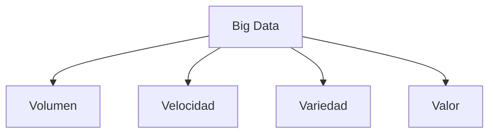

# Big Data: Motivación, Almacenamiento y Procesamiento 🚀📊

El término **Big Data** ha tomado un protagonismo inmenso en la era digital. No solo se trata de manejar grandes volúmenes de datos, sino de extraer valor de ellos para tomar decisiones más informadas y estratégicas. Desde sus orígenes hasta su integración con tecnologías avanzadas como el Cloud Computing, el Big Data ha revolucionado la forma en que las organizaciones operan en todos los sectores.

## 🌟 Motivación del Big Data y su Origen

El **Big Data** surgió como respuesta a la necesidad de manejar cantidades masivas de datos generados por dispositivos digitales, redes sociales, sensores IoT y más. Empresas como Google y Facebook fueron pioneras en el uso de técnicas de almacenamiento y procesamiento masivo para analizar estos datos y extraer información valiosa.

### ¿Por qué es Importante el Big Data?

1. **Tomar Decisiones Basadas en Datos**: Las empresas ahora pueden analizar grandes conjuntos de datos para identificar patrones y tendencias, permitiendo decisiones más rápidas y acertadas.
   
2. **Optimización de Procesos**: Desde la cadena de suministro hasta el marketing, el análisis de Big Data permite optimizar operaciones y reducir costos.

3. **Innovación y Desarrollo de Nuevos Productos**: El análisis de datos ayuda a identificar nuevas oportunidades de mercado y a desarrollar productos que satisfagan mejor las necesidades del cliente.

---

## 🏢 Almacenamiento Masivo de Datos: Las 4Vs del Big Data

El almacenamiento de datos es una piedra angular del Big Data. Para entender su complejidad, es esencial conocer las 4Vs: **Volumen, Velocidad, Variedad y Valor**.

### 1. **Volumen** 📦: 
Cantidades masivas de datos generados cada segundo, desde redes sociales hasta sensores IoT.

### 2. **Velocidad** ⚡: 
La rapidez con la que se generan y deben procesarse los datos para obtener valor en tiempo real.

### 3. **Variedad** 🌈: 
Datos en múltiples formatos, tanto estructurados como no estructurados, incluyendo texto, imágenes y videos.

### 4. **Valor** 💰: 
La capacidad de transformar los datos en información útil y aplicable para la toma de decisiones.

---

## 📂 Sistemas de Almacenamiento de Datos

Los sistemas de almacenamiento deben cumplir con ciertos requisitos clave para manejar Big Data:

1. **Capacidad**: Deben soportar el crecimiento continuo de los datos sin comprometer el rendimiento.
2. **Rendimiento**: Capacidad de acceder y procesar datos rápidamente.
3. **Fiabilidad**: Asegurar que los datos están protegidos contra pérdidas y fallos del sistema.
4. **Recuperabilidad**: Facilitar la recuperación de datos tras una falla o pérdida accidental.

### 🚀 Dispositivos Más Usados Actualmente

1. **Discos (HDD, SSD, RAID)**: 
    - Los discos duros HDD ofrecen almacenamiento de alta capacidad a bajo costo.
    - Los SSD son más rápidos y eficientes, ideales para aplicaciones que requieren alta velocidad.
    - Los arreglos RAID mejoran la fiabilidad y el rendimiento al combinar varios discos en una configuración redundante.

2. **Cintas Magnéticas** 🧲: Aunque puede parecer una tecnología antigua, sigue siendo utilizada para archivado de grandes volúmenes de datos debido a su bajo costo.

3. **Almacenamiento en Red (NAS, SAN)** 🌐: Permite compartir almacenamiento a través de una red, facilitando el acceso a datos desde múltiples dispositivos.

4. **Almacenamiento en la Nube** ☁️: Ofrece escalabilidad, flexibilidad y recuperación de datos en caso de fallos.

---

### 🛠️ Métodos Avanzados de Almacenamiento: Clusters

Los clusters y sistemas distribuidos permiten manejar datos masivos de manera más eficiente y segura.

- **Tipos de RAID**: Desde RAID 0 hasta RAID 10, ofrecen diferentes niveles de redundancia y rendimiento.
  
- **GlusterFS y MooseFS**: Sistemas de archivos distribuidos que permiten el almacenamiento y la gestión eficiente de grandes volúmenes de datos en clusters.

- **CephFileSystem**: Ofrece almacenamiento distribuido altamente escalable con capacidades avanzadas de recuperación y auto-reparación.

- **DRBD (Distributed Replicated Block Device)**: Proporciona replicación de datos en tiempo real, asegurando que los datos estén siempre disponibles y sincronizados.

---

## 🔍 Procesamiento de Datos: De la Recolección a la Visualización

El procesamiento de datos en Big Data implica una serie de etapas clave para transformar los datos brutos en información valiosa.

### 1. **Recolección de Datos** 📥: 
Recoger datos de diversas fuentes como sensores, redes sociales y bases de datos.

### 2. **Recopilación de Datos**: 
Consolidar los datos recolectados en una base central para su procesamiento.

### 3. **Preprocesamiento o Limpieza de Datos** 🧹: 
Eliminar datos redundantes, inconsistentes o incompletos para mejorar la calidad.

### 4. **Procesamiento** 🖥️: 
Aplicar algoritmos de análisis y transformación para extraer patrones y conocimiento de los datos.

### 5. **Interpretación y Salida** 📊: 
Convertir los resultados del procesamiento en informes o visualizaciones comprensibles.

### 6. **Visualización de Datos** 📈: 
Utilizar gráficos, dashboards y otros medios visuales para presentar los hallazgos.

### 7. **Análisis** 🧠: 
Profundizar en los datos procesados para descubrir insights que guíen la toma de decisiones.

### 8. **Almacenamiento**: 
Guardar los resultados de análisis para futuros usos o auditorías.

---

## ⚙️ Elementos del Procesamiento de Datos

Los elementos clave en el procesamiento de datos incluyen servidores de procesamiento, algoritmos de análisis y herramientas de integración que permiten a los sistemas trabajar juntos eficientemente.

### Minería de Datos ⛏️

La minería de datos extrae patrones significativos de grandes conjuntos de datos, ayudando a predecir tendencias y comportamientos futuros.

### Datos No Estructurados 📑

Una gran parte de los datos generados son no estructurados (e.g., texto, video, imágenes) y requieren técnicas avanzadas de análisis y procesamiento.

### Problemas de Datos No Compatibles ❌

La heterogeneidad de los datos y la falta de estándares pueden dificultar su integración y análisis, creando desafíos en la calidad y compatibilidad.

### Calidad y Seguridad de Datos 🔒

La integridad y seguridad de los datos son fundamentales para garantizar que los análisis sean fiables y se mantenga la privacidad de la información.

### Extracción de Datos Completa o Incremental

La extracción completa procesa todos los datos disponibles, mientras que la incremental solo analiza los cambios recientes, ahorrando tiempo y recursos.

### Procesamiento en Clusters 🚦

El procesamiento distribuido permite que múltiples nodos trabajen en paralelo para manejar grandes volúmenes de datos de manera eficiente.

---

## 📈 Analítica de Big Data

La analítica de Big Data permite a las empresas aprovechar los datos en tiempo real para mejorar la toma de decisiones y la eficiencia operativa.

### **IoT (Internet of Things)** 🌐

Los dispositivos IoT generan una cantidad masiva de datos que se analizan en tiempo real para optimizar operaciones como la gestión de flotas o el mantenimiento predictivo.

### **Analítica en Tiempo Real** ⏱️

Permite responder instantáneamente a eventos como transacciones financieras o cambios en la demanda del mercado, proporcionando una ventaja competitiva significativa.

---

## ☁️ Big Data y Cloud Computing

La combinación de Big Data con Cloud Computing ha abierto nuevas posibilidades para las empresas, proporcionando escalabilidad, flexibilidad y reducción de costos.

### Ventajas del Cloud Computing para Big Data

- **Escalabilidad Ilimitada**: Permite ajustar los recursos en función de las necesidades sin comprometer el rendimiento.
- **Costos Bajo Demanda**: Paga solo por los recursos que utilizas, optimizando los costos operativos.
- **Accesibilidad Global**: Los datos y las aplicaciones pueden ser accesibles desde cualquier lugar, facilitando la colaboración.
- **Seguridad y Recuperación**: Ofrece soluciones avanzadas para la recuperación de desastres y la seguridad de los datos.

---

## 🚀 Conclusión

El Big Data ha transformado la forma en que las organizaciones capturan, almacenan y procesan datos. Desde los orígenes del Big Data hasta las avanzadas soluciones de Cloud Computing, esta tecnología ha proporcionado una plataforma poderosa para la innovación y la toma de decisiones estratégicas. La combinación de almacenamiento masivo, procesamiento distribuido y análisis en tiempo real está remodelando industrias enteras y allanando el camino hacia un futuro basado en datos. ¡Aprovecha el poder del Big Data para llevar tu organización al siguiente nivel! 📊🌟