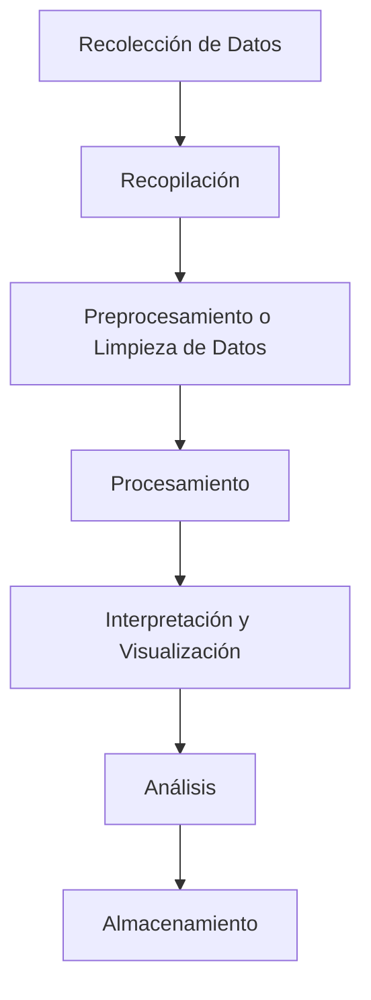

# Big Data: Motivación, Almacenamiento y Procesamiento 🚀📊

El término **Big Data** ha ganado una gran relevancia en la era digital moderna. No se trata solo de manejar grandes volúmenes de datos, sino de extraer valor y conocimiento de ellos para tomar decisiones informadas y estratégicas. Desde sus orígenes hasta su integración con tecnologías avanzadas como el **Cloud Computing** y la **Inteligencia Artificial**, el Big Data ha revolucionado la forma en que las organizaciones operan en múltiples sectores.

## 🌟 Motivación del Big Data y su Origen

El **Big Data** surgió como una respuesta natural a la creciente cantidad de datos generados por dispositivos digitales, redes sociales, sensores IoT, smartphones, y una multitud de otros dispositivos conectados a la red. Este crecimiento exponencial de datos obligó a las organizaciones a buscar soluciones para almacenar, procesar y analizar eficientemente esta información masiva.

Empresas pioneras como **Google**, **Facebook** y **Amazon** fueron las primeras en desarrollar e implementar infraestructuras capaces de manejar cantidades inmensas de datos. Al hacerlo, comenzaron a descubrir patrones, comportamientos y tendencias que ofrecían insights valiosos para la toma de decisiones.

### ¿Por qué es Importante el Big Data?

El **Big Data** ha sido un motor clave para la transformación digital de las empresas. A través del análisis masivo de datos, las organizaciones pueden descubrir patrones y relaciones que no eran visibles antes, optimizando su rendimiento y abriendo nuevas oportunidades de crecimiento. Las razones clave de su importancia incluyen:

1. **Tomar Decisiones Basadas en Datos**: 
   Gracias al análisis de grandes volúmenes de datos, las empresas pueden identificar patrones y tendencias que antes eran difíciles de detectar. Esto permite tomar decisiones más rápidas y acertadas. Por ejemplo, una empresa minorista puede analizar millones de transacciones de clientes para identificar qué productos tienen una mayor probabilidad de compra en ciertas temporadas.

2. **Optimización de Procesos**: 
   El Big Data permite optimizar procesos en todos los niveles. Desde la cadena de suministro hasta el marketing, el análisis de datos permite identificar ineficiencias y áreas de mejora. Un ejemplo claro es el uso de datos en la **logística**, donde el análisis de rutas en tiempo real puede reducir los tiempos de entrega y los costos de transporte.

3. **Innovación y Desarrollo de Nuevos Productos**: 
   El análisis de datos masivos permite identificar nuevas oportunidades de mercado y desarrollar productos personalizados para satisfacer mejor las necesidades del cliente. Por ejemplo, empresas del sector de la salud pueden analizar grandes cantidades de datos médicos para identificar tendencias de consumo en productos saludables, lo que puede llevar al desarrollo de productos más alineados con los intereses del consumidor.

---

## 🏢 Almacenamiento Masivo de Datos: Las Vs del Big Data

El almacenamiento de grandes volúmenes de datos es un pilar fundamental en el ecosistema de Big Data. Tradicionalmente, se mencionan las "4Vs" para describir las características de Big Data, pero en realidad, existen muchas más Vs que añaden complejidad y potencial a su análisis:

- **Volumen** 📦: Se refiere a la enorme cantidad de datos generados y almacenados en sistemas digitales cada segundo. Desde redes sociales hasta dispositivos IoT, cada actividad genera datos que se deben almacenar y analizar. Empresas como **Facebook** y **YouTube** generan petabytes de datos diariamente. El reto es manejar este volumen de datos de manera eficiente sin perder velocidad de procesamiento.

- **Velocidad** ⚡: Es la rapidez con la que se generan, recopilan y procesan los datos. Los sistemas de Big Data deben ser capaces de procesar la información casi en tiempo real para generar valor. Por ejemplo, empresas financieras utilizan datos en tiempo real para tomar decisiones sobre inversiones.

- **Variedad** 🌈: Los datos provienen de diferentes fuentes y formatos, como texto, imágenes, videos, audio, transacciones, sensores IoT, etc. Esto hace necesario el uso de tecnologías avanzadas capaces de analizar tanto datos estructurados (como bases de datos) como no estructurados (como publicaciones en redes sociales).

- **Veracidad** 🛡️: La calidad de los datos es crucial para tomar decisiones acertadas. Los datos incorrectos, duplicados o incompletos pueden llevar a conclusiones erróneas. Garantizar la veracidad de los datos implica establecer controles de calidad y limpieza antes de procesarlos para asegurar su fiabilidad.

- **Variabilidad**: No solo los volúmenes de datos crecen, sino que también varían constantemente. Las tendencias y patrones de comportamiento cambian a lo largo del tiempo, y el análisis debe adaptarse a estos cambios.

- **Valor** 💰: Es la capacidad de extraer insights útiles de grandes volúmenes de datos. De nada sirve almacenar cantidades masivas de datos si no se puede extraer valor de ellos. Las empresas que logran transformar los datos en información valiosa pueden mejorar su posición competitiva y tomar mejores decisiones.

Para más información sobre las múltiples Vs del Big Data, puedes consultar esta infografía: [Infografía sobre Big Data](https://afiescuela-new.storage.googleapis.com/cms_multimedia/cms_medias/files/000/003/421/original/Infografia_sobre_el_Big_Data.Final.jpg?1678801345).

---

## 📂 Sistemas de Almacenamiento de Datos

El almacenamiento de grandes volúmenes de datos debe cumplir con una serie de requisitos clave para manejar el crecimiento de la información de manera eficiente. Estos requisitos son:

1. **Capacidad**: Los sistemas de almacenamiento deben ser escalables para soportar el crecimiento continuo de datos sin comprometer el rendimiento del sistema.
2. **Rendimiento**: El acceso rápido y eficiente a los datos es esencial para asegurar un procesamiento eficaz. Los sistemas de almacenamiento deben estar optimizados para acceder a los datos de manera ágil, sin cuellos de botella.
3. **Fiabilidad**: Es crucial asegurar que los datos estén protegidos contra pérdidas y fallos del sistema. La replicación y redundancia de datos ayudan a garantizar la disponibilidad continua de la información.
4. **Recuperabilidad**: En caso de un fallo o pérdida accidental de datos, los sistemas deben facilitar su recuperación de manera rápida y eficiente, minimizando el tiempo de inactividad.

### 🚀 Dispositivos Más Usados

1. **Discos (HDD, SSD, RAID)**: 
    - Los discos duros (HDD) ofrecen gran capacidad de almacenamiento a bajo costo, pero son más lentos en comparación con los SSD.
    - Los discos de estado sólido (SSD) son mucho más rápidos y eficientes, lo que los hace ideales para aplicaciones que requieren procesamiento a alta velocidad.
    - Los arreglos RAID mejoran tanto la fiabilidad como el rendimiento al combinar varios discos en configuraciones redundantes. Esto permite la continuidad del servicio en caso de fallos de un disco individual.

    

2. **Cintas Magnéticas** 🧲: Aunque puede parecer una tecnología antigua, las cintas magnéticas siguen siendo una opción popular para el archivado a largo plazo debido a su bajo costo. Se utilizan comúnmente para almacenar grandes volúmenes de datos que no necesitan ser accedidos con frecuencia, como copias de seguridad.

3. **Almacenamiento en Red (NAS, SAN)** 🌐: 
    - **NAS** (Network Attached Storage) y **SAN** (Storage Area Network) permiten compartir almacenamiento a través de una red, facilitando el acceso a los datos desde múltiples dispositivos. Estas soluciones son comunes en empresas que manejan grandes cantidades de datos de forma colaborativa.

4. **Almacenamiento en la Nube** ☁️: El almacenamiento en la nube se ha convertido en una de las soluciones más populares debido a su escalabilidad, flexibilidad y capacidad para facilitar la recuperación de datos ante desastres. Además, permite a las empresas reducir costos al no tener que invertir en infraestructura propia.

---

### 🛠️ Métodos Avanzados de Almacenamiento: Clusters

Los sistemas distribuidos y clusters permiten gestionar grandes volúmenes de datos de manera más eficiente, segura y escalable. Estos sistemas distribuyen los datos en varios nodos o servidores, asegurando redundancia y mejorando el rendimiento.

- **Tipos de RAID**: Los diferentes niveles de RAID (como RAID 0, RAID 1, RAID 5, RAID 10) ofrecen diversas combinaciones de redundancia y rendimiento. RAID 5, por ejemplo, ofrece un equilibrio entre protección de datos y rendimiento, siendo ideal para entornos que necesitan redundancia sin sacrificar velocidad.

- **GlusterFS y MooseFS**: Son sistemas de archivos distribuidos diseñados para manejar grandes volúmenes de datos. Estos sistemas permiten a las organizaciones administrar sus datos a través de múltiples servidores, garantizando la disponibilidad y la redundancia de la información.

- **CephFileSystem**: Es un sistema de almacenamiento distribuido y altamente escalable que ofrece capacidades avanzadas de auto-reparación y recuperación. Es utilizado por grandes empresas que necesitan manejar petabytes de datos.

- **DRBD (Distributed Replicated Block Device)**: Proporciona replicación de datos en tiempo real entre servidores, asegurando que los datos estén siempre disponibles y sincronizados en múltiples ubicaciones. Esto es vital para sistemas de alta disponibilidad.

---

## 🔍 Procesamiento de Datos: De la Recolección a la Visualización

El procesamiento de datos en Big Data abarca una serie de etapas clave que transforman los datos brutos en información útil y aplicable. Cada etapa es esencial para obtener insights valiosos. A continuación, ilustramos cada fase utilizando un **ejemplo en el sector de la salud**, donde se analizan datos de millones de pacientes para detectar patrones relacionados con enfermedades crónicas como la diabetes o la hipertensión.

### 📝 Etapas de Procesamiento

1. **Recolección de Datos** 📥:  
    En el caso de la salud, los datos provienen de diversas fuentes como:
    - **Historiales médicos electrónicos (EMR)**.
    - **Dispositivos portátiles** como pulseras de actividad o relojes inteligentes que monitorean constantes vitales.
    - **Encuestas y cuestionarios de salud**.
    - **Bases de datos genéticas**.

    **Ejemplo**: Recolectamos datos de los niveles de glucosa, actividad física y dieta de millones de pacientes que utilizan dispositivos médicos y de bienestar.

2. **Recopilación**: Una vez recolectados, los datos de diferentes fuentes se consolidan en un **almacén de datos distribuido** (como un sistema Hadoop o un almacén en la nube como **Amazon S3** o **Azure Blob Storage**) para su análisis posterior.

    **Ejemplo**: Los datos de pacientes de varios hospitales y dispositivos médicos son centralizados en una plataforma de almacenamiento en la nube para ser procesados de manera unificada.

3. **Preprocesamiento o Limpieza de Datos** 🧹: En esta fase, se eliminan los datos duplicados, inconsistentes o incompletos para asegurar la calidad del análisis. Se estandarizan los formatos de datos para que todas las fuentes utilicen las mismas unidades de medida y estructura.

    **Ejemplo**: Se eliminan las entradas duplicadas y se estandarizan las unidades de medida (por ejemplo, convertir los niveles de glucosa de mg/dL a mmol/L) para que los datos sean coherentes en todo el conjunto.

4. **Procesamiento** 🖥️: Se aplican algoritmos avanzados como **machine learning** y técnicas de **minería de datos** para analizar patrones dentro de los datos de los pacientes y predecir la probabilidad de desarrollar enfermedades crónicas.

    **Ejemplo**: Un algoritmo de regresión logística analiza los datos y predice la probabilidad de que un paciente desarrolle diabetes en los próximos cinco años en función de sus niveles de glucosa, actividad física y genética.

5. **Interpretación y Visualización** 📊: Los resultados se presentan mediante gráficos interactivos, dashboards y reportes comprensibles que ayudan a los médicos a entender los patrones y tendencias.

    **Ejemplo**: Un dashboard interactivo muestra gráficos sobre cómo diferentes factores como la obesidad, la falta de ejercicio y los antecedentes familiares influyen en el riesgo de desarrollar diabetes. Los médicos pueden ver fácilmente cómo varían estos factores según la región geográfica o la edad del paciente.

6. **Análisis** 🧠: En esta fase se profundiza en los resultados obtenidos para descubrir **insights** valiosos. Por ejemplo, el análisis puede revelar correlaciones inesperadas entre los hábitos alimenticios y la aparición de enfermedades.

    **Ejemplo**: El análisis revela que el 80% de los pacientes con obesidad y antecedentes familiares tienen una alta probabilidad de desarrollar diabetes tipo 2 dentro de los próximos cinco años.

7. **Almacenamiento**: Finalmente, los datos analizados y sus resultados se almacenan para usos futuros, auditorías o para ser comparados con nuevos datos en investigaciones posteriores.

    **Ejemplo**: Los resultados se almacenan en una base de datos distribuida para su posterior análisis y comparación con nuevos pacientes a lo largo del tiempo, lo que permite un monitoreo continuo de las tendencias de salud pública.

---

## 📈 Analítica en Tiempo Real

Uno de los mayores beneficios del Big Data es la capacidad de realizar **análisis en tiempo real**. La analítica en tiempo real permite a las empresas reaccionar inmediatamente ante eventos que ocurren en el momento. Algunos ejemplos incluyen:

- **Servicios Financieros**: Las instituciones financieras utilizan análisis en tiempo real para monitorear transacciones y detectar posibles fraudes en el momento en que ocurren. Esto permite bloquear transacciones sospechosas antes de que se completen.

- **Plataformas de Streaming**: Empresas como Netflix y Spotify analizan en tiempo real el comportamiento de sus usuarios para ofrecer recomendaciones personalizadas sobre qué series, películas o canciones ver o escuchar a continuación.

- **Smart Cities**: Las ciudades inteligentes utilizan sensores distribuidos en toda la infraestructura urbana para monitorear el tráfico, los niveles de contaminación y el consumo de energía en tiempo real. Esto permite ajustes automáticos para optimizar el uso de recursos y mejorar la calidad de vida de los ciudadanos.

---

## ☁️ Big Data y Cloud Computing

El **Cloud Computing** ha abierto un nuevo mundo de posibilidades para el Big Data. Al combinar ambas tecnologías, las empresas pueden escalar sus operaciones sin necesidad de costosas inversiones en infraestructura física.

### Ventajas del Cloud Computing para Big Data

- **Escalabilidad Ilimitada**: El cloud computing permite a las empresas ajustar su capacidad de procesamiento y almacenamiento según sea necesario. Esto significa que pueden escalar vertical y horizontalmente sin comprometer el rendimiento.

- **Costos Bajo Demanda**: Las empresas solo pagan por los recursos que utilizan, lo que optimiza los costos operativos y evita gastos innecesarios en infraestructura física.

- **Accesibilidad Global**: El almacenamiento en la nube permite que los datos y las aplicaciones sean accesibles desde cualquier parte del mundo, facilitando la colaboración entre equipos distribuidos geográficamente.

- **Seguridad y Recuperación**: Las soluciones en la nube ofrecen avanzadas medidas de seguridad y recuperación ante desastres, asegurando que los datos estén protegidos y disponibles incluso en situaciones de emergencia.

---

## 🚀 Conclusión

El **Big Data** ha transformado la forma en que las organizaciones capturan, almacenan, procesan y analizan datos. Desde sus orígenes hasta las avanzadas soluciones de **Cloud Computing** y **Inteligencia Artificial**, el Big Data ha proporcionado una plataforma poderosa para la innovación y la toma de decisiones estratégicas. La combinación de almacenamiento masivo, procesamiento distribuido y análisis en tiempo real está remodelando industrias enteras, creando nuevas oportunidades y optimizando las operaciones empresariales. ¡Es el momento de aprovechar el poder del Big Data para llevar tu organización al siguiente nivel!