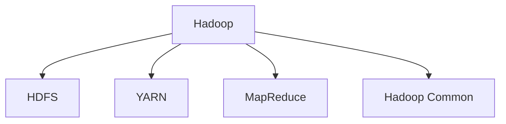
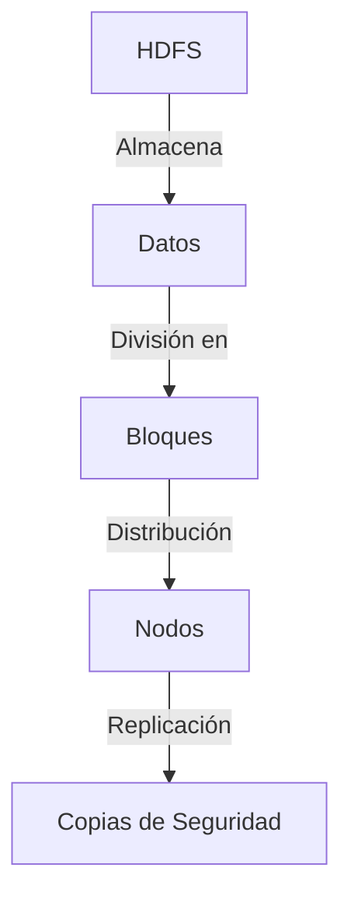

# ¿Qué es Apache Hadoop? 🚀

**Apache Hadoop** es un marco de software de código abierto diseñado para el almacenamiento y procesamiento masivo de datos en clústeres de computadoras. Gracias a su arquitectura distribuida, Hadoop es capaz de manejar grandes cantidades de información de manera eficiente y rentable, convirtiéndose en un pilar esencial en el mundo del Big Data.

Hadoop no solo almacena datos, sino que también facilita su procesamiento en paralelo, lo que permite analizar información compleja rápidamente. Su capacidad para escalar desde unos pocos servidores hasta miles lo convierte en una herramienta flexible y poderosa para empresas de todos los tamaños.

### 🧠 ¿Cómo Funciona Hadoop?

Hadoop se compone principalmente de cuatro módulos que trabajan en conjunto para proporcionar un ecosistema completo de Big Data:



1. **HDFS (Hadoop Distributed File System)** 📂: Almacena grandes volúmenes de datos distribuidos a través de múltiples nodos, garantizando alta disponibilidad y resistencia a fallos.

2. **YARN (Yet Another Resource Negotiator)** 🎯: Actúa como un administrador de recursos, asignando tareas y gestionando recursos de manera eficiente dentro del clúster.

3. **MapReduce** 🛠️: Es el motor de procesamiento de datos que divide las tareas en subtareas más pequeñas, permitiendo el procesamiento en paralelo de grandes conjuntos de datos.

4. **Hadoop Common** ⚙️: Proporciona las herramientas y utilidades básicas que soportan los demás módulos, facilitando la integración y el funcionamiento del ecosistema.

---

### 🚦 ¿Por Qué Elegir Hadoop?

#### 1. **Escalabilidad Infinita** 🏗️

Hadoop está diseñado para crecer junto con tus necesidades. Desde unos pocos nodos hasta miles de máquinas, puede manejar crecimientos exponenciales de datos sin perder rendimiento. Su arquitectura permite la adición de nodos sin necesidad de reconfigurar el sistema, lo que facilita la expansión continua.

#### 2. **Rentabilidad** 💰

El uso de hardware básico y de bajo costo hace que Hadoop sea una solución asequible para las empresas que necesitan manejar grandes volúmenes de datos. Al contrario de otros sistemas de datos que requieren hardware especializado, Hadoop se ejecuta en servidores comunes, reduciendo significativamente los costos de infraestructura.

#### 3. **Flexibilidad y Adaptabilidad** 🔄

No importa si tus datos son estructurados, no estructurados o semiestructurados; Hadoop puede almacenar y procesar cualquier tipo de información. Esto lo hace ideal para un amplio rango de aplicaciones, desde análisis de redes sociales hasta procesamiento de registros de sensores.

#### 4. **Resistencia a Fallos** 🔒

Hadoop está diseñado con la seguridad en mente. Al replicar datos en varios nodos dentro del clúster, garantiza que la información esté disponible incluso si un nodo falla, asegurando la continuidad operativa sin interrupciones.

#### 5. **Procesamiento Rápido y Paralelo** ⚡

Gracias a MapReduce, Hadoop procesa grandes volúmenes de datos en paralelo, dividiendo tareas complejas en subtareas más pequeñas. Esto ahorra tiempo y mejora la eficiencia al manejar trabajos que, de otro modo, podrían llevar horas o días.

---

### 🧩 Componentes Detallados de Hadoop

#### **HDFS (Hadoop Distributed File System)** 📂

El corazón del almacenamiento en Hadoop es HDFS. Diseñado para manejar archivos de gran tamaño, distribuye los datos en bloques a través de múltiples nodos en el clúster. La replicación de bloques asegura que, incluso si un nodo falla, los datos permanezcan accesibles.



- **Alta Disponibilidad**: Los datos se replican en varios nodos, garantizando acceso continuo.
- **Escalabilidad**: Añadir más nodos incrementa automáticamente la capacidad de almacenamiento.
- **Acceso Rápido**: Diseñado para leer y escribir datos de manera eficiente, optimizando el tiempo de respuesta.

#### **YARN (Yet Another Resource Negotiator)** 🎯

YARN es el cerebro detrás de la asignación de recursos en Hadoop. Se asegura de que cada aplicación tenga acceso a los recursos necesarios para ejecutar sus tareas de manera eficiente.

```javascript
// Ejemplo básico de cómo YARN maneja tareas
const yarnTask = {
  id: 'task123',
  resources: {
    cpu: 4, // Núcleos de CPU asignados
    memory: '16GB' // Memoria asignada
  },
  execute: () => {
    console.log('Ejecutando tarea en el clúster de Hadoop');
  }
};

yarnTask.execute();
```

- **Asignación Dinámica**: Distribuye recursos según la necesidad de las aplicaciones en tiempo real.
- **Optimización del Clúster**: Maximiza el uso de recursos, evitando cuellos de botella.

#### **MapReduce** 🛠️

MapReduce divide los trabajos en dos etapas: "Map" y "Reduce". En la primera, los datos se procesan y se transforman en pares clave-valor. En la segunda, estos pares se combinan para producir el resultado final.

```javascript
// Ejemplo simplificado de MapReduce en JavaScript
const map = (data) => {
  return data.map(item => ({ key: item, value: 1 })); // Paso de mapeo
};

const reduce = (mappedData) => {
  return mappedData.reduce((acc, curr) => {
    acc[curr.key] = (acc[curr.key] || 0) + curr.value;
    return acc;
  }, {});
};

const data = ['manzana', 'naranja', 'manzana', 'pera'];
const mapped = map(data);
const reduced = reduce(mapped);

console.log(reduced); // { manzana: 2, naranja: 1, pera: 1 }
```

- **Procesamiento Paralelo**: Divide las tareas para ejecutarlas simultáneamente, acelerando el análisis.
- **Fácil de Escalar**: Añadir más nodos permite manejar volúmenes de datos mayores sin comprometer la velocidad.

#### **Hadoop Common** ⚙️

Es el pegamento que mantiene todo junto, proporcionando las bibliotecas y utilidades necesarias para que los otros módulos funcionen correctamente. Ofrece herramientas esenciales para la configuración, monitoreo y administración del ecosistema Hadoop.

---

### 🌐 Casos de Uso de Hadoop

Hadoop ha revolucionado múltiples industrias gracias a su capacidad para manejar grandes volúmenes de datos de manera eficiente. Aquí algunos de los sectores donde Hadoop marca la diferencia:

#### **1. Finanzas y Bancos** 🏦

- **Detección de Fraudes**: Analiza patrones en tiempo real para detectar y prevenir actividades fraudulentas.
- **Análisis de Riesgos**: Procesa grandes volúmenes de datos financieros para identificar y gestionar riesgos.

#### **2. Salud** 🏥

- **Genómica**: Procesa datos de secuenciación genética para avanzar en la medicina personalizada.
- **Análisis de Imágenes Médicas**: Maneja grandes volúmenes de imágenes para mejorar diagnósticos y tratamientos.

#### **3. Telecomunicaciones** 📡

- **Análisis de Redes**: Monitorea y optimiza el rendimiento de las redes en tiempo real.
- **Modelos Predictivos**: Utiliza datos históricos para prever fallos y optimizar el servicio al cliente.

#### **4. Retail y E-commerce** 🛒

- **Análisis del Comportamiento del Cliente**: Utiliza datos de navegación y compra para personalizar ofertas.
- **Gestión de Inventarios**: Optimiza la cadena de suministro basada en patrones de compra y demanda.

---

### 🚀 ¡Comienza con Hadoop Hoy!

Si tu objetivo es aprovechar al máximo tus datos y llevar tus capacidades analíticas al siguiente nivel, Hadoop es la herramienta que necesitas. Con su escalabilidad, flexibilidad y eficiencia, es una solución inigualable para los desafíos del Big Data en el mundo moderno. Empieza a explorar las posibilidades que Hadoop tiene para ofrecer y desbloquea el verdadero potencial de tus datos.

### 🛠️ Ejemplo Completo de Integración en JavaScript:

```javascript
const hdfs = require('hdfs'); // Biblioteca para interactuar con HDFS

// Conectar a HDFS
const client = hdfs({
  protocol: 'http', // Protocolo de conexión
  hostname: 'localhost', // Host de Hadoop
  port: 9870 // Puerto de HDFS
});

// Crear un nuevo archivo en HDFS
client.createFile('/user/data.txt', 'Hola, Hadoop!', (err) => {
  if (err) {
    console.error('Error al crear archivo:', err);
  } else {
    console.log('Archivo creado exitosamente!');
  }
});

// Leer archivos en un directorio
client.listStatus('/user/', (err, files) => {
  if (err) {
    console.error('Error al listar archivos:', err);
  } else {
    console.log('Archivos en el directorio:', files);
  }
});
```

### 🌐 Conclusión

Apache Hadoop no es solo una tecnología; es una revolución en la forma en que manejamos y procesamos los datos.

 Desde pequeñas startups hasta grandes corporaciones, la adopción de Hadoop ha transformado la capacidad de las organizaciones para tomar decisiones basadas en datos. ¡Es hora de sumergirse en el mundo del Big Data con Hadoop y descubrir lo que puedes lograr!