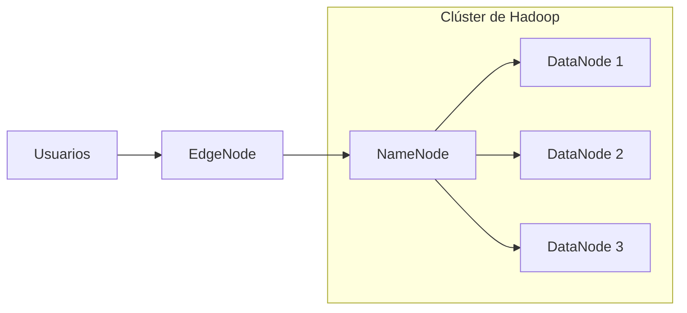

### ¿Qué es Apache Hadoop? 🚀

**Apache Hadoop** es un marco de software de código abierto diseñado para el almacenamiento y procesamiento masivo de datos en clústeres de computadoras. Gracias a su arquitectura distribuida, Hadoop es capaz de manejar grandes cantidades de información de manera eficiente y rentable, convirtiéndose en un pilar esencial en el mundo del Big Data.

Hadoop no solo almacena datos, sino que también facilita su procesamiento en paralelo, lo que permite analizar grandes volúmenes de información de manera rápida. Su capacidad para escalar desde unos pocos servidores hasta miles lo convierte en una herramienta flexible y poderosa para empresas de todos los tamaños.

---

### 🧠 ¿Cómo Funciona Hadoop?

Hadoop se compone principalmente de cuatro módulos que trabajan en conjunto para proporcionar un ecosistema completo de Big Data:

1. **HDFS (Hadoop Distributed File System)** 📂: Almacena grandes volúmenes de datos distribuidos a través de múltiples nodos, garantizando alta disponibilidad y resistencia a fallos.

2. **YARN (Yet Another Resource Negotiator)** 🎯: Actúa como un administrador de recursos, asignando tareas y gestionando recursos de manera eficiente dentro del clúster.

3. **MapReduce** 🛠️: Es el motor de procesamiento de datos que divide las tareas en subtareas más pequeñas, permitiendo el procesamiento en paralelo de grandes conjuntos de datos.

4. **Hadoop Common** ⚙️: Proporciona las herramientas y utilidades básicas que soportan los demás módulos, facilitando la integración y el funcionamiento del ecosistema.

---

### 🚦 ¿Por Qué Elegir Hadoop?

#### 1. **Escalabilidad Infinita** 🏗️

Hadoop está diseñado para crecer junto con tus necesidades. Desde unos pocos nodos hasta miles de máquinas, puede manejar crecimientos exponenciales de datos sin perder rendimiento. Su arquitectura permite la adición de nodos sin necesidad de reconfigurar el sistema, lo que facilita la expansión continua.

#### 2. **Rentabilidad** 💰

El uso de hardware básico y de bajo costo hace que Hadoop sea una solución asequible para las empresas que necesitan manejar grandes volúmenes de datos. A diferencia de otros sistemas de datos que requieren hardware especializado, Hadoop se ejecuta en servidores comunes, reduciendo significativamente los costos de infraestructura.

#### 3. **Flexibilidad y Adaptabilidad** 🔄

No importa si tus datos son estructurados, no estructurados o semiestructurados; Hadoop puede almacenar y procesar cualquier tipo de información. Esto lo hace ideal para un amplio rango de aplicaciones, desde análisis de redes sociales hasta procesamiento de registros de sensores.

#### 4. **Resistencia a Fallos** 🔒

Hadoop está diseñado con la seguridad en mente. Al replicar datos en varios nodos dentro del clúster, garantiza que la información esté disponible incluso si un nodo falla, asegurando la continuidad operativa sin interrupciones.

#### 5. **Procesamiento Rápido y Paralelo** ⚡

Gracias a MapReduce, Hadoop procesa grandes volúmenes de datos en paralelo, dividiendo tareas complejas en subtareas más pequeñas. Esto ahorra tiempo y mejora la eficiencia al manejar trabajos que, de otro modo, podrían llevar horas o días.

---

### 🔧 Procesamiento Distribuido, Clústeres y Tipos de Nodos

El procesamiento distribuido es el corazón de Apache Hadoop, permitiendo que grandes volúmenes de datos se dividan en partes más pequeñas y se procesen de manera simultánea en varios nodos dentro de un clúster.

#### **Procesamiento Distribuido**

El procesamiento distribuido implica dividir las tareas de procesamiento de datos en partes más pequeñas, las cuales se ejecutan de forma paralela en diferentes máquinas o nodos. En lugar de procesar los datos de forma secuencial en un solo servidor, Hadoop divide los datos en bloques que son procesados simultáneamente. Esto aumenta la eficiencia y reduce el tiempo necesario para analizar grandes volúmenes de información.

##### **Clústeres en Hadoop**

Un clúster en Hadoop está compuesto por un conjunto de nodos conectados entre sí, que trabajan en conjunto para almacenar y procesar datos de manera distribuida. Los clústeres están diseñados para ser escalables, lo que significa que se pueden agregar más nodos según sea necesario, incrementando la capacidad de procesamiento sin afectar el rendimiento general.

  - **Escalabilidad Horizontal**: Se logra añadiendo más nodos al clúster.
  - **Distribución de Carga**: Los datos y tareas se distribuyen entre todos los nodos para maximizar el uso eficiente de los recursos.

##### **Tipos de Nodos en Hadoop**

En un clúster de Hadoop, existen varios tipos de nodos que desempeñan funciones críticas dentro del sistema:

1. **Nodo Maestro (NameNode)**:  
    - **Función**: Coordina el almacenamiento de datos y gestiona el sistema de archivos distribuido (**HDFS**). Supervisa la ubicación de los bloques de datos y garantiza la replicación para asegurar la resistencia a fallos.
    - **Responsabilidades**: Mantiene el registro de dónde están almacenados los bloques de datos en los **DataNodes**. El **NameNode** es esencial para la administración general del clúster y su buen funcionamiento.

2. **Nodos de Datos (DataNode)**:  
    - **Función**: Son responsables de almacenar los bloques de datos y responder a las solicitudes del **NameNode**. Estos nodos realizan la mayor parte del trabajo pesado al manejar los datos en bruto.
    - **Responsabilidades**: Almacenan los bloques de datos y ejecutan las tareas de procesamiento. Cada **DataNode** puede almacenar varias copias de los datos, asegurando la replicación y la alta disponibilidad. Esto garantiza la recuperación de datos en caso de fallos.

3. **Nodos Edge (EdgeNode)**:  
    - **Función**: Los **nodos edge** actúan como un puente entre el clúster Hadoop y la red externa. Son los nodos a través de los cuales los usuarios pueden interactuar con el clúster, enviar trabajos y obtener resultados.
    - **Responsabilidades**: Proporcionan interfaces para que los datos y comandos entren y salgan del clúster de manera segura. Estos nodos no almacenan ni procesan datos directamente, pero ofrecen una capa de seguridad y control al filtrar el acceso y las solicitudes a los **NameNodes** y **DataNodes**.

#### **Tolerancia a Fallos en los Nodos**

Hadoop garantiza la **tolerancia a fallos** mediante la replicación de los datos en múltiples DataNodes. Si un nodo falla, los datos aún están disponibles en otros nodos del clúster, lo que evita la pérdida de información y garantiza que el procesamiento continúe sin interrupciones.

---

### 🌐 Casos de Uso de Hadoop

Hadoop ha revolucionado múltiples industrias gracias a su capacidad para manejar grandes volúmenes de datos de manera eficiente. Aquí algunos de los sectores donde Hadoop marca la diferencia:

#### **1. Finanzas y Bancos** 🏦

- **Detección de Fraudes**: Analiza patrones en tiempo real para detectar y prevenir actividades fraudulentas.
- **Análisis de Riesgos**: Procesa grandes volúmenes de datos financieros para identificar y gestionar riesgos.

#### **2. Salud** 🏥

- **Genómica**: Procesa datos de secuenciación genética para avanzar en la medicina personalizada.
- **Análisis de Imágenes Médicas**: Maneja grandes volúmenes de imágenes para mejorar diagnósticos y tratamientos.

#### **3. Telecomunicaciones** 📡

- **Análisis de Redes**: Monitorea y optimiza el rendimiento de las redes en tiempo real.
- **Modelos Predictivos**: Utiliza datos históricos para prever fallos y optimizar el servicio al cliente.

#### **4. Retail y E-commerce** 🛒

- **Análisis del Comportamiento del Cliente**: Utiliza datos de navegación y compra para personalizar ofertas.
- **Gestión de Inventarios**: Optimiza la cadena de suministro basada en patrones de compra y demanda.

---

### 🌐 Conclusión

Apache Hadoop no es solo una tecnología; es una revolución en la forma en que manejamos y procesamos grandes volúmenes de datos. Desde su capacidad para escalar hasta miles de nodos, hasta su capacidad para procesar datos en paralelo, Hadoop ha transformado la forma en que las organizaciones analizan y gestionan sus datos.