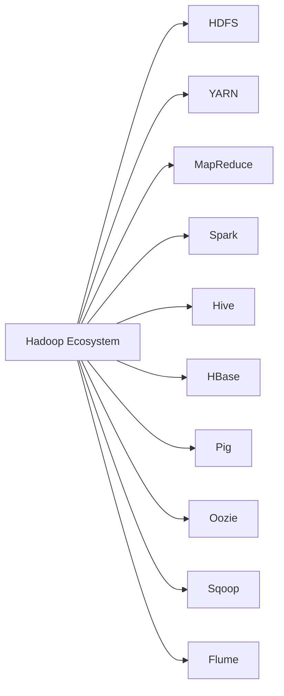

# Ecosistema Hadoop y Distribuciones 🌐🚀

El **ecosistema Hadoop** ha revolucionado la forma en que las organizaciones manejan y procesan datos a gran escala. Hadoop no es solo un software; es un ecosistema completo de herramientas y tecnologías que trabajan juntas para resolver los desafíos del Big Data. A medida que el volumen, la variedad y la velocidad de los datos continúan creciendo, el ecosistema Hadoop se expande para incluir múltiples componentes y distribuciones diseñadas para aprovechar al máximo esta revolución de datos.

## 🧠 ¿Qué es el Ecosistema Hadoop?

El ecosistema Hadoop es una colección de proyectos y herramientas que interactúan entre sí para proporcionar una plataforma integral para el almacenamiento, procesamiento y análisis de grandes volúmenes de datos. Este ecosistema incluye componentes para la ingestión de datos, el procesamiento en tiempo real, el análisis avanzado y la gestión de recursos.



### Componentes Clave del Ecosistema Hadoop 🛠️

1. **HDFS (Hadoop Distributed File System)** 📂: El sistema de archivos distribuido que almacena grandes volúmenes de datos de manera eficiente y segura.

2. **YARN (Yet Another Resource Negotiator)** 🎯: Gestor de recursos que asigna y administra las tareas dentro del clúster Hadoop.

3. **MapReduce** 🛠️: Modelo de programación que permite el procesamiento paralelo de datos en un entorno distribuido.

4. **Apache Spark** ⚡: Motor de procesamiento rápido y en memoria que ofrece una alternativa más ágil a MapReduce para el análisis de datos en tiempo real.

5. **Apache Hive** 🐝: Herramienta que facilita la consulta y el análisis de datos almacenados en HDFS utilizando un lenguaje similar a SQL, conocido como HiveQL.

6. **Apache HBase** 📊: Base de datos NoSQL de alto rendimiento que proporciona acceso en tiempo real a grandes volúmenes de datos distribuidos.

7. **Apache Pig** 🐷: Lenguaje de alto nivel para el procesamiento de grandes conjuntos de datos que simplifica la escritura de scripts complejos en comparación con MapReduce.

8. **Apache Oozie** 📅: Coordinador de flujos de trabajo que permite programar y gestionar trabajos en Hadoop.

9. **Apache Sqoop** 🔄: Herramienta que facilita la transferencia de datos entre Hadoop y bases de datos relacionales.

10. **Apache Flume** 📥: Sistema de ingestión de datos que permite recopilar, agregar y mover grandes cantidades de datos de eventos a Hadoop.

---

### 🌐 Distribuciones Populares de Hadoop

Las distribuciones de Hadoop son paquetes que integran el ecosistema de herramientas Hadoop con características adicionales de administración y soporte. Estas distribuciones están diseñadas para simplificar la implementación, configuración y mantenimiento de clústeres Hadoop. Aquí te presentamos algunas de las más populares:

#### 1. **Cloudera Distribution for Hadoop (CDH)** 🏢

Cloudera es una de las distribuciones comerciales más reconocidas de Hadoop. Ofrece una versión completa del ecosistema Hadoop con herramientas adicionales para la gestión, seguridad y análisis de datos.

- **Gestión Simplificada**: Cloudera Manager permite gestionar y monitorear el clúster de forma centralizada.
- **Seguridad Mejorada**: Ofrece encriptación de datos y autenticación avanzada.
- **Optimización de Desempeño**: Ajustes automáticos que mejoran la eficiencia de las tareas.

```javascript
// Ejemplo de conexión a un clúster de Hadoop usando Cloudera
const cloudera = require('cloudera-api');

// Conectar al clúster de Cloudera
const client = new cloudera.Cluster({
  hostname: 'cloudera-cluster.local',
  username: 'admin',
  password: 'password'
});

client.getStatus((err, status) => {
  if (err) {
    console.error('Error conectando al clúster:', err);
  } else {
    console.log('Estado del clúster:', status);
  }
});
```

#### 2. **Hortonworks Data Platform (HDP)** 🐘

Hortonworks, ahora parte de Cloudera, ofrece una distribución de Hadoop completamente de código abierto. HDP se enfoca en la integración de datos y proporciona un sólido conjunto de herramientas para el análisis y la gestión de datos.

- **Soporte 100% Open Source**: Fomenta la innovación y permite la personalización completa de la plataforma.
- **Integración con la Nube**: Compatible con implementaciones en la nube y en entornos híbridos.
- **Simplificación de Operaciones**: Herramientas para la automatización de flujos de trabajo y la gestión de datos.

#### 3. **MapR** 🌲

MapR destaca por su arquitectura única que combina Hadoop con un sistema de archivos distribuido patentado y una base de datos NoSQL integrada. Ofrece una alta disponibilidad y rendimiento superior en comparación con otras distribuciones.

- **MapR XD y MapR DB**: Proporcionan almacenamiento y gestión de datos avanzados con capacidades empresariales.
- **Soporte de Contenedores y Microservicios**: Compatible con Kubernetes para la implementación de aplicaciones modernas.
- **Procesamiento en Tiempo Real**: Capacidades para análisis de flujos de datos en tiempo real.

```javascript
// Ejemplo de integración con MapR usando JavaScript
const mapr = require('mapr-streams');

// Configuración de una conexión de flujo de datos en tiempo real
const stream = mapr.createStream('/path/to/stream');

stream.on('data', (message) => {
  console.log('Mensaje recibido:', message.value.toString());
});

stream.write({ key: 'sensor1', value: 'temperatura: 22°C' });
```

#### 4. **Amazon EMR (Elastic MapReduce)** ☁️

Amazon EMR es la distribución basada en la nube de Hadoop ofrecida por AWS. Permite escalar fácilmente el clúster y ajustar los recursos según la demanda de procesamiento de datos.

- **Escalabilidad Automática**: Ajusta la capacidad del clúster en función de la carga de trabajo.
- **Integración con Servicios AWS**: Fácil integración con S3, Redshift y otras soluciones de AWS.
- **Costos Bajo Demanda**: Paga solo por lo que usas, optimizando los costos operativos.

---

### 🚦 Casos de Uso del Ecosistema Hadoop

El ecosistema Hadoop no solo almacena datos; lo transforma en valor accionable. A continuación, se presentan algunos casos de uso donde las empresas utilizan Hadoop y sus herramientas para generar impacto:

#### **1. Análisis de Redes Sociales** 🗨️

Las empresas analizan millones de interacciones en redes sociales para entender las tendencias del mercado y la opinión del cliente. Herramientas como Spark y Hive se utilizan para procesar estos datos rápidamente.

#### **2. Recomendación de Productos** 🛍️

Las plataformas de e-commerce utilizan algoritmos de aprendizaje automático en Hadoop para analizar el comportamiento del usuario y recomendar productos personalizados en tiempo real.

```javascript
// Ejemplo de recomendación de productos usando Spark y JavaScript
const spark = require('apache-spark');

// Crear un modelo de recomendación basado en el historial de compras del usuario
const recommendations = spark.mllib.recommendation.ALS.train(usersPurchases, 10, 0.01);

recommendations.predict(user, (err, products) => {
  if (err) {
    console.error('Error generando recomendaciones:', err);
  } else {
    console.log('Productos recomendados:', products);
  }
});
```

#### **3. Prevención de Fraudes Financieros** 🏦

Bancos y aseguradoras usan Hadoop para analizar transacciones en tiempo real y detectar patrones sospechosos. Hadoop permite combinar múltiples fuentes de datos para una detección de fraudes más precisa y rápida.

#### **4. Monitoreo de Infraestructuras** 📡

Las empresas de telecomunicaciones utilizan el ecosistema Hadoop para monitorear sus infraestructuras de red, detectando fallos y optimizando el rendimiento en tiempo real.

---

### 🛠️ Ejemplo Completo de Integración del Ecosistema Hadoop en JavaScript

Para entender cómo funciona el ecosistema Hadoop en la práctica, consideremos un ejemplo completo que integra varios componentes:

```javascript
const hdfs = require('hdfs');
const spark = require('apache-spark');
const hive = require('hive-client');

// Configuración de HDFS
const hdfsClient = hdfs({
  protocol: 'http',
  hostname: 'localhost',
  port: 9870
});

// Subir datos a HDFS
hdfsClient.createFile('/user/data.txt', 'Datos para análisis', (err) => {
  if (err) {
    console.error('Error al subir archivo:', err);
  } else {
    console.log('Archivo subido a HDFS correctamente.');
  }
});

// Consultar datos en Hive
const hiveClient = hive.createClient({ host: 'localhost', port: 10000 });

hiveClient.connect().then(() => {
  hiveClient.query('SELECT * FROM logs WHERE event="error";', (err, results) => {
    if (err) {
      console.error('Error en la consulta Hive:', err);
    } else {
     

 console.log('Resultados de la consulta:', results);
    }
  });
});

// Procesar datos con Spark
spark.session.builder().getOrCreate().then(session => {
  const dataFrame = session.read().format('csv').load('/user/data.txt');

  dataFrame.filter(dataFrame.col('event').equalTo('error'))
    .show()
    .then(() => session.stop());
});
```

---

### 🌟 Conclusión

El ecosistema Hadoop y sus diversas distribuciones son fundamentales para cualquier estrategia de Big Data moderna. Ofrecen una solución integral para almacenar, procesar y analizar datos a gran escala, permitiendo a las empresas tomar decisiones informadas basadas en datos. Con la flexibilidad para manejar todo tipo de datos y la capacidad de escalar a cualquier tamaño de clúster, Hadoop continúa liderando la transformación digital en todo el mundo. ¡Explora el poder del ecosistema Hadoop y descubre cómo puede revolucionar tu gestión de datos! 🚀📊