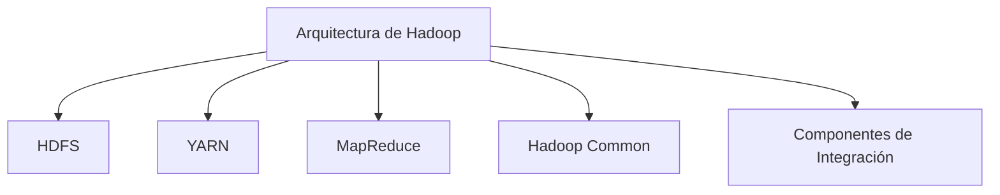
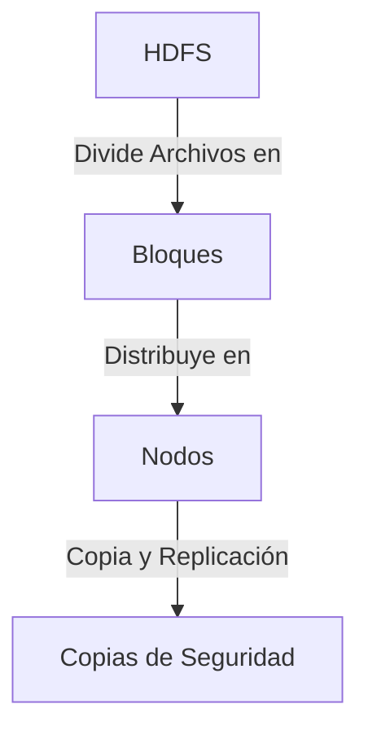
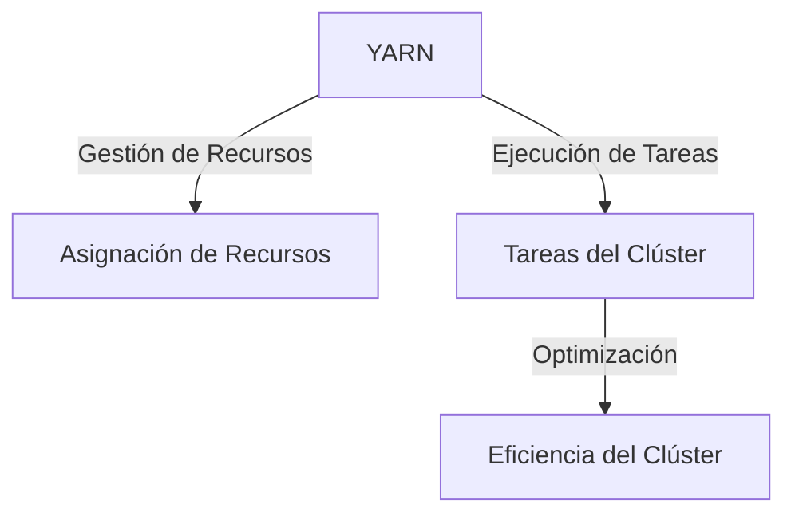
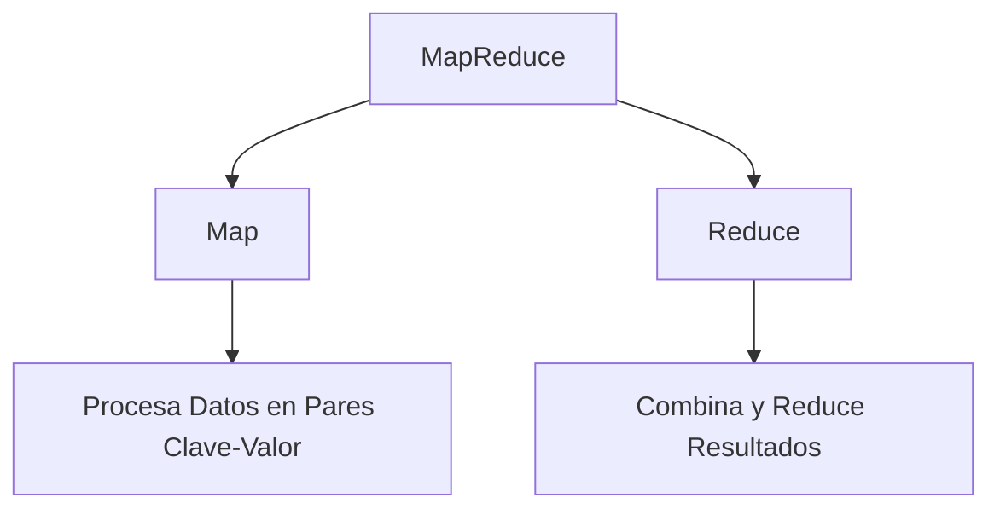
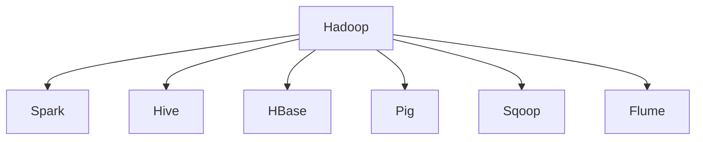

# Arquitectura de Hadoop: Desentrañando la Potencia del Big Data 🚀🧠

**Apache Hadoop** es una plataforma robusta de código abierto diseñada para almacenar y procesar grandes volúmenes de datos de manera eficiente y escalable. Pero ¿qué hace que Hadoop sea tan poderoso? La respuesta radica en su arquitectura distribuida, que permite procesar datos a través de múltiples nodos de manera paralela. En este artículo, exploraremos en detalle la arquitectura de Hadoop, desglosando sus componentes y cómo trabajan juntos para hacer del Big Data una realidad accesible.

## 🧩 Componentes Principales de la Arquitectura de Hadoop

La arquitectura de Hadoop se compone de varios módulos que colaboran para ofrecer un entorno completo de almacenamiento y procesamiento de datos. Los componentes clave son:



### 1. HDFS (Hadoop Distributed File System) 📂

**HDFS** es el sistema de archivos distribuido de Hadoop, diseñado para almacenar datos de manera segura y eficiente en grandes clústeres. Se encarga de dividir los archivos grandes en bloques y distribuirlos a través de diferentes nodos en el clúster.



#### Características de HDFS:

- **Alta Disponibilidad**: Al replicar los bloques de datos en varios nodos, asegura que los datos estén siempre disponibles, incluso si uno de los nodos falla.
- **Escalabilidad**: Añadir nuevos nodos al clúster incrementa automáticamente la capacidad de almacenamiento.
- **Tolerancia a Fallos**: Diseñado para detectar y recuperarse automáticamente de fallos de hardware y software.

### 2. YARN (Yet Another Resource Negotiator) 🎯

**YARN** actúa como el gestor de recursos de Hadoop. Asigna recursos de procesamiento a las aplicaciones y coordina la ejecución de tareas en el clúster, asegurando que los trabajos se completen de manera eficiente.



#### Características de YARN:

- **Asignación Dinámica de Recursos**: Distribuye recursos según las necesidades de las aplicaciones en tiempo real, optimizando el uso del clúster.
- **Seguridad y Control**: Ofrece control granular sobre la ejecución de tareas, garantizando la seguridad y estabilidad del sistema.
- **Escalabilidad**: Permite la expansión del clúster sin necesidad de reconfiguraciones complejas.

### 3. MapReduce 🛠️

**MapReduce** es el modelo de programación de Hadoop que permite el procesamiento paralelo de grandes volúmenes de datos. Consiste en dos fases principales: **Map** y **Reduce**.



- **Map**: Toma los datos de entrada y los procesa en pares clave-valor.
- **Reduce**: Combina estos pares para generar un resultado final.

#### Ejemplo de MapReduce en JavaScript:

```javascript
// Ejemplo de MapReduce para contar palabras
const map = (text) => {
  return text.split(' ').map(word => ({ key: word, value: 1 }));
};

const reduce = (mappedData) => {
  return mappedData.reduce((acc, curr) => {
    acc[curr.key] = (acc[curr.key] || 0) + curr.value;
    return acc;
  }, {});
};

const data = "Hadoop es increíble, Hadoop es poderoso";
const mapped = map(data);
const reduced = reduce(mapped);

console.log(reduced); // { Hadoop: 2, es: 2, increíble: 1, poderoso: 1 }
```

### 4. Hadoop Common ⚙️

**Hadoop Common** proporciona las bibliotecas y utilidades necesarias que soportan los otros módulos de Hadoop, asegurando la integración y el funcionamiento adecuado de todo el ecosistema.

- **Funciones Básicas**: Ofrece soporte para la gestión de configuración, registro y acceso remoto.
- **Soporte Multiplataforma**: Compatible con diferentes sistemas operativos, lo que facilita su implementación en cualquier entorno.

### 5. Componentes de Integración 🔌

Hadoop no funciona en solitario. Se integra con varias herramientas y tecnologías para ampliar sus capacidades y proporcionar un entorno más completo para la gestión de datos:



- **Apache Spark** ⚡: Ofrece procesamiento en memoria, lo que acelera las tareas de análisis en comparación con MapReduce.
- **Apache Hive** 🐝: Permite consultas SQL sobre datos almacenados en HDFS, facilitando el análisis de datos.
- **Apache HBase** 📊: Proporciona acceso en tiempo real a grandes volúmenes de datos distribuidos, ideal para aplicaciones que requieren baja latencia.
- **Apache Pig** 🐷: Un lenguaje de alto nivel para escribir scripts que procesen grandes conjuntos de datos de manera más simple que MapReduce.
- **Apache Sqoop** 🔄: Facilita la transferencia de datos entre Hadoop y bases de datos relacionales.
- **Apache Flume** 📥: Recoge, agrega y mueve grandes cantidades de datos de eventos a Hadoop.

---

## 🚦 ¿Cómo Trabajan Juntos los Componentes de Hadoop?

La arquitectura de Hadoop se basa en la sinergia de sus componentes. Cada módulo desempeña un papel esencial en el procesamiento y almacenamiento de datos a gran escala, trabajando de manera conjunta para ofrecer un entorno completo y robusto.

1. **Ingestión de Datos**: Los datos se recopilan mediante herramientas como Flume o Sqoop y se almacenan en HDFS.
   
2. **Gestión de Recursos**: YARN administra los recursos del clúster, asegurando que las tareas se distribuyan de manera eficiente.

3. **Procesamiento de Datos**: Se realiza mediante MapReduce, Spark, Pig o Hive, dependiendo del tipo de análisis requerido.

4. **Acceso y Análisis**: Hive proporciona un lenguaje similar a SQL para consultar y analizar datos, mientras que HBase permite el acceso en tiempo real.

5. **Automatización de Flujos de Trabajo**: Oozie coordina la ejecución de trabajos y la automatización de tareas repetitivas en el clúster.

---

## 🌟 Ejemplo Completo de Integración de la Arquitectura Hadoop en JavaScript

Para ilustrar cómo todos estos componentes trabajan en conjunto, veamos un ejemplo práctico de integración utilizando JavaScript:

```javascript
const hdfs = require('hdfs'); // Interacción con HDFS
const yarn = require('yarn-client'); // Gestión de tareas en el clúster
const hive = require('hive-client'); // Consultas en Hive

// Conectar a HDFS
const hdfsClient = hdfs({
  protocol: 'http',
  hostname: 'localhost',
  port: 9870
});

// Subir datos a HDFS
hdfsClient.createFile('/user/data.txt', 'Hadoop es un sistema distribuido', (err) => {
  if (err) {
    console.error('Error al crear archivo en HDFS:', err);
  } else {
    console.log('Archivo creado en HDFS.');
  }
});

// Ejecutar tarea con YARN
const yarnClient = new yarn.Client();
yarnClient.submitJob('analyze-data', '/user/data.txt', (err) => {
  if (err) {
    console.error('Error ejecutando trabajo en YARN:', err);
  } else {
    console.log('Trabajo completado en YARN.');
  }
});

// Consultar resultados en Hive
const hiveClient = hive.createClient({ host: 'localhost', port: 10000 });

hiveClient.connect().then(() => {
  hiveClient.query('SELECT * FROM logs WHERE event="Hadoop";', (err, results) => {
    if (err) {
      console.error('Error en la consulta Hive:', err);
    } else {
      console.log('Resultados de la consulta Hive:', results);
    }
  });
});
```

---

## 🚀 Conclusión

La arquitectura de Hadoop es un ejemplo brillante de cómo los sistemas distribuidos pueden transformar la manera en que manejamos y analizamos datos masivos. Con una combinación de almacenamiento robusto, gestión eficiente de recursos y capacidades avanzadas de procesamiento, Hadoop se ha convertido en la columna vertebral del Big Data moderno. Ya sea que estés trabajando en análisis de datos, modelado predictivo o simplemente necesites un sistema escalable y resistente, la arquitectura de Hadoop proporciona las herramientas necesarias para desbloquear el verdadero potencial de tus datos. 🌐