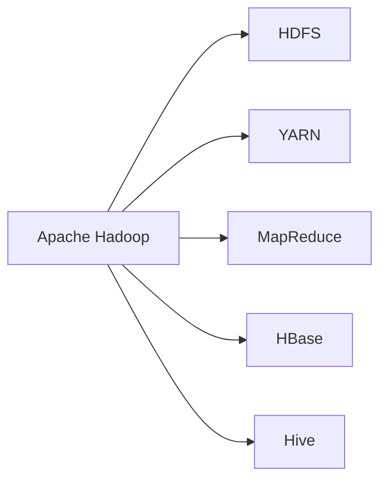

# Apache Hadoop a Alto Nivel

### 🧑‍💻 Introducción a Apache Hadoop

Apache Hadoop es una de las tecnologías más influyentes en el campo del Big Data. Esta plataforma de código abierto permite almacenar y procesar grandes volúmenes de datos de manera eficiente, gracias a su arquitectura distribuida y escalable.



### 📊 Componentes Principales

1. **HDFS (Hadoop Distributed File System)**: Sistema de archivos distribuido que permite almacenar grandes volúmenes de datos de forma redundante, asegurando su disponibilidad y durabilidad.

   ```plaintext
   # Ejemplo de almacenamiento en HDFS
   hadoop fs -put localfile.txt /hadoop/path/
   ```

2. **YARN (Yet Another Resource Negotiator)**: Gestor de recursos que asigna tareas a los nodos disponibles en el clúster, optimizando el uso de la infraestructura.

3. **MapReduce**: Modelo de programación para procesar y generar grandes conjuntos de datos de manera paralela.

   ```plaintext
   # Pseudocódigo de MapReduce
   map(String key, String value):
       emit(key, value_length)

   reduce(String key, Iterator values):
       sum = 0
       for value in values:
           sum += value
       emit(key, sum)
   ```

4. **HBase**: Base de datos NoSQL que permite acceso en tiempo real a grandes volúmenes de datos almacenados en HDFS.

5. **Hive**: Herramienta que proporciona una interfaz SQL para consultar y manejar datos almacenados en Hadoop.

### 🚀 Beneficios de Apache Hadoop

- **Escalabilidad Horizontal**: Permite añadir más nodos al clúster para aumentar la capacidad de procesamiento y almacenamiento.
- **Alta Disponibilidad**: Asegura la replicación de datos y el balanceo de carga entre los nodos.
- **Costo Efectivo**: Utiliza hardware común, reduciendo significativamente los costos en comparación con soluciones propietarias.

### 🎯 Aplicaciones Comunes

- **Análisis de Datos a Gran Escala**: Utilizado en sectores como finanzas, salud y marketing para analizar grandes volúmenes de datos de manera eficiente.
- **Procesamiento de Log Files**: Herramienta clave para analizar logs de servidores web y obtener insights en tiempo real.
- **Machine Learning**: Facilita la construcción de modelos a partir de conjuntos de datos masivos.

### 🌐 Conclusión

Apache Hadoop ha revolucionado la forma en que las empresas manejan y procesan grandes volúmenes de datos, proporcionando una plataforma flexible, escalable y rentable. Su arquitectura modular permite integrar diversas herramientas, haciendo de Hadoop una elección poderosa para cualquier estrategia de Big Data.

¡Empieza tu viaje en Big Data con Hadoop y desbloquea el poder de los datos masivos! 🚀
