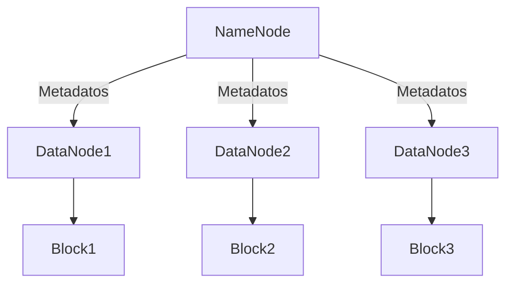
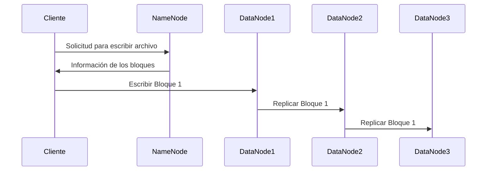
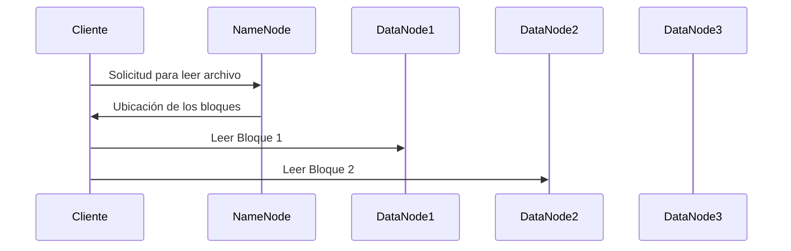
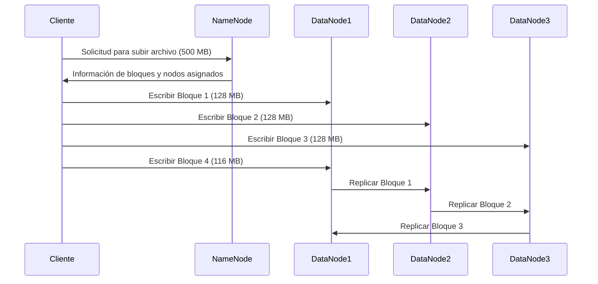
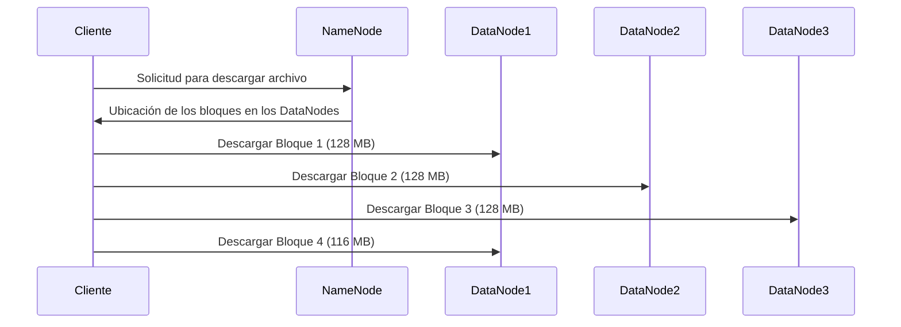

# **Comprendiendo HDFS: Una Guía Completa**

## 🚀 ¿Qué es HDFS?

HDFS significa **Hadoop Distributed File System** (Sistema de Archivos Distribuido de Hadoop), y es la columna vertebral de la capacidad de Hadoop para manejar grandes cantidades de datos. Se originó a partir de GFS (Google File System) y está diseñado para almacenar y gestionar grandes volúmenes de datos de manera eficiente, distribuyéndolos a través de varios nodos en un clúster.

HDFS proporciona tolerancia a fallos y acceso de alto rendimiento a grandes conjuntos de datos, lo que lo hace ideal para aplicaciones que manejan procesamiento a gran escala, como minería de datos, aprendizaje automático y análisis.

---

## 🧩 **Arquitectura de HDFS: Nodos y Tipos**

La arquitectura de HDFS gira en torno a dos componentes principales:

1. **NameNode**: El nodo maestro que controla los metadatos de los archivos y la estructura del directorio.
2. **DataNodes**: Estos son los nodos trabajadores responsables de almacenar los datos reales en bloques. Cada bloque tiene un tamaño predeterminado de 128 MB, pero este valor es configurable.

### **Tipos Clave de Nodos:**

- **NameNode (Maestro)**: Almacena metadatos de los archivos (como nombres, permisos, ubicación de los bloques).
- **DataNode (Trabajador)**: Almacena bloques de datos y envía señales de estado (heartbeat) al NameNode para confirmar que está activo.

HDFS sigue una política de replicación para mantener la integridad de los datos, donde cada bloque se replica en varios DataNodes para garantizar la redundancia.

---

## 🛠 **Cómo Funciona HDFS:**

### **Proceso de Escritura** ✏️
Cuando un cliente escribe un archivo en HDFS:

1. El archivo se divide en **bloques** (fragmentos de datos) y se distribuye en múltiples **DataNodes**.
2. El **NameNode** almacena los metadatos sobre qué bloques pertenecen al archivo y en qué DataNodes están almacenados.
3. Cada bloque se replica (típicamente tres veces) en diferentes DataNodes para asegurar la **tolerancia a fallos**.

### **Proceso de Lectura** 📖
Cuando un cliente lee un archivo de HDFS:

1. El cliente solicita al **NameNode** la ubicación de los bloques.
2. El cliente recupera los bloques de datos directamente de los **DataNodes**.
3. Los datos se ensamblan nuevamente en el archivo original.

---

## 📂 **Ejemplo: Subida y Descarga de un Archivo**

### **Subida de un Archivo (500 MB)**

El archivo de 500 MB se divide en **bloques de 128 MB**. Debido a la configuración predeterminada de HDFS, los bloques se replican en varios DataNodes para garantizar la **tolerancia a fallos**. En este caso, el archivo se dividirá en 4 bloques (3 bloques de 128 MB y 1 de 116 MB).

### **Descarga de un Archivo (500 MB)**

Para leer el archivo, el **NameNode** le indica al cliente dónde se encuentran almacenados los bloques. El cliente recupera los bloques directamente desde los **DataNodes** y los reensambla para formar el archivo completo.

### **Distribución de los Bloques**
En el diagrama, el proceso muestra cómo el archivo de 500 MB se divide en **4 bloques**, con los bloques replicados en los diferentes **DataNodes** para garantizar la **disponibilidad** y **redundancia** en caso de fallos.

---

### **Ventajas de HDFS:**
- **Escalabilidad**: Se puede escalar fácilmente añadiendo más nodos.
- **Tolerancia a fallos**: Se recupera automáticamente de fallos de nodos debido a la replicación de bloques.
- **Alto rendimiento**: Optimizado para procesamiento por lotes, lo que permite un alto rendimiento de datos.

HDFS es una parte clave del ecosistema de Hadoop y es esencial para gestionar eficientemente grandes conjuntos de datos.