```mermaid
graph TD;
    Texto[Documento de Entrada] -->|Fragmentar en Palabras| Map[Función Map]
    Map --> Intermedio[Claves y Valores Intermedios]
    Intermedio --> Shuffle[Shuffle & Sort]
    Shuffle --> Reduce[Función Reduce]
    Reduce --> Resultado[Frecuencia de Palabras]
```

```mermaid
graph TD;
    Ventas[Datos de Ventas] -->|Leer Producto y Venta| Map[Función Map]
    Map --> Intermedio[Claves: Producto, Valores: Ventas]
    Intermedio --> Shuffle[Shuffle & Sort]
    Shuffle --> Reduce[Función Reduce]
    Reduce --> Resultado[Ventas Totales por Producto]
```

# 🖥️ **MapReduce: Procesamiento Distribuido Eficiente en Grandes Volúmenes de Datos**

## 🚀 **¿Qué es MapReduce?**

**MapReduce** es un modelo de programación diseñado para procesar grandes volúmenes de datos de forma distribuida en clústeres de servidores. Fue desarrollado por Google como parte de su infraestructura para manejar y analizar cantidades masivas de información en Internet.

El modelo **MapReduce** se compone principalmente de dos fases:

- **Map**: divide una tarea grande en sub-tareas más pequeñas, asignándolas a nodos en el clúster. Por ejemplo, si se quiere contar el número de palabras en un texto, el nodo **Map** puede dividir el texto en palabras y emitir un par clave-valor `(palabra, 1)` para cada una de ellas.
- **Reduce**: toma los resultados de las sub-tareas y los combina en un resultado final. En el caso de contar palabras, el nodo **Reduce** puede sumar todos los valores de una palabra determinada y emitir un par clave-valor `(palabra, total)`.

Es ampliamente utilizado en sistemas distribuidos como **Apache Hadoop**, donde permite el procesamiento de petabytes de datos de manera eficiente.

---

## 🧩 **¿Cómo Funciona MapReduce?**

1. **Map**: Los datos de entrada son divididos en fragmentos y procesados en paralelo por diferentes nodos. Cada nodo aplica una función de **mapeo** para generar pares clave-valor intermedios. Por ejemplo, si se quiere contar el número de palabras en un texto, el nodo **Map** puede dividir el texto en palabras y emitir un par clave-valor `(palabra, 1)` para cada una de ellas.
   
2. **Shuffle & Sort**: Los resultados de la fase **Map** son organizados y agrupados por clave. Este proceso permite que todos los valores relacionados con una clave se envíen al mismo nodo en la fase de **Reduce**.

3. **Reduce**: El nodo ejecuta una función que combina los valores asociados con la misma clave, generando un conjunto de resultados finales. En el caso de contar palabras, el nodo **Reduce** puede sumar todos los valores de una palabra determinada y emitir un par clave-valor `(palabra, total)`.

---

## 🛠️ **Estructura de un Programa MapReduce**

Un programa MapReduce típico se compone de dos funciones clave: **map** y **reduce**.

```javascript
// Función MAP
function map(key, value) {
  // Divide el valor de entrada y emite pares clave-valor
  const words = value.split(' ');
  for (const word of words) {
    emit(word, 1);
  }
}

// Función REDUCE
function reduce(key, values) {
  // Suma todos los valores para cada clave
  const sum = values.reduce((a, b) => a + b, 0);
  emit(key, sum);
}
```

---

## 📊 **Diagrama de Flujo de un Programa MapReduce**

```mermaid
graph TD;
    A[Datos de Entrada] -->|Fragmentar| B[Fase Map]
    B --> C[Shuffle & Sort]
    C --> D[Fase Reduce]
    D --> E[Resultado Final]
    
    B -->|Claves y Valores Intermedios| C
    C -->|Agrupación por Clave| D
```



Este diagrama ilustra cómo los datos de entrada son primero procesados por la fase **Map**, luego se organizan por clave en **Shuffle & Sort**, y finalmente se combinan en la fase **Reduce** para generar el resultado final.

---

## 🎓 **Ejemplos Populares de MapReduce**

### 1. **Word Count (Conteo de Palabras)**

Este programa MapReduce cuenta cuántas veces aparece cada palabra en un conjunto de documentos.

#### **Fase Map**

```javascript
function map(key, value) {
  const words = value.split(' ');
  for (const word of words) {
    emit(word, 1);  // (clave, valor) => (palabra, 1)
  }
}
```

#### **Fase Reduce**

```javascript
function reduce(key, values) {
  const total = values.reduce((a, b) => a + b, 0);
  emit(key, total);  // (clave, valor) => (palabra, total)
}
```



**Explicación**:

- La fase **Map** emite pares clave-valor `(palabra, 1)` para cada palabra en el texto.
- La fase **Shuffle** agrupa todas las instancias de la misma palabra.
- La fase **Reduce** suma todas las ocurrencias de una palabra y emite el resultado final.

---

### 2. **Sumar Ventas por Producto**

Este ejemplo muestra cómo sumar el total de ventas por producto a partir de un conjunto de registros de ventas.

#### **Datos de Entrada**
```plaintext
ProductoA, 20
ProductoB, 15
ProductoA, 10
ProductoC, 30
ProductoB, 5
```

#### **Fase Map**
La función `map` toma cada línea de ventas y emite un par clave-valor donde la clave es el nombre del producto y el valor es la venta.

```javascript
function map(key, value) {
  const [product, sales] = value.split(', ');
  emit(product, parseInt(sales));  // (clave, valor) => (producto, ventas)
}
```

#### **Fase Reduce**
La función `reduce` toma todas las ventas de un producto en particular y las suma.

```javascript
function reduce(key, values) {
  const totalSales = values.reduce((a, b) => a + b, 0);
  emit(key, totalSales);  // (clave, valor) => (producto, ventas_totales)
}
```



**Explicación**:

- La fase **Map** toma cada línea de ventas y emite pares clave-valor donde la clave es el producto y el valor es la venta.
- La fase **Shuffle** agrupa todas las ventas de cada producto.
- La fase **Reduce** suma las ventas totales para cada producto y emite el resultado final.

---

## 💡 **¿Por qué es Importante MapReduce?**
MapReduce es fundamental para el procesamiento de grandes cantidades de datos debido a su capacidad para:

- **Escalabilidad**: Procesar datos en paralelo a través de múltiples servidores.
- **Tolerancia a fallos**: Maneja automáticamente los errores en los nodos, replicando datos para asegurar su disponibilidad.
- **Simplicidad**: Permite a los desarrolladores escribir programas para grandes volúmenes de datos sin preocuparse por la infraestructura subyacente.

¡Con MapReduce, el procesamiento distribuido de grandes datos se vuelve accesible y eficiente! 🎉