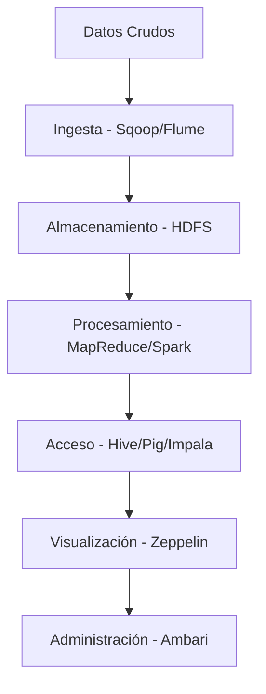

# Unidad 3: Introducción al Ecosistema Hadoop 🚀

Bienvenido a la Unidad 3, donde nos adentraremos en el **fascinante ecosistema Hadoop**. Esta unidad está diseñada para que comprendas las múltiples herramientas que conforman el sistema Hadoop, permitiéndote manejar grandes volúmenes de datos de forma eficiente y a gran escala. ¿Estás listo? ¡Vamos a explorar juntos! 🌐

---

## ¿Qué encontrarás en esta unidad? 📚

El ecosistema Hadoop es vasto y complejo, compuesto por múltiples componentes que facilitan la **ingesta, almacenamiento, procesamiento y análisis de datos**. Aquí encontrarás una estructura que desglosa cada uno de estos elementos clave, desde los componentes de acceso y procesamiento hasta las herramientas de ingesta y flujo de trabajo, sin olvidar las interfaces y el procesamiento en tiempo real.

### Estructura de la Unidad 3:

```plaintext
Unidad_3_Ecosistema_Hadoop/
├── 1_Introduccion/
│   └── introduccion.md
├── 2_Componentes_Acceso_Procesamiento/
│   ├── Apache_Pig.md
│   ├── Apache_Hive/
│   │   ├── conceptos_generales.md
│   │   ├── arquitectura.md
│   │   └── HQL.md
│   ├── Apache_Impala.md
│   ├── Apache_HBase.md
│   ├── Apache_Phoenix.md
│   └── Apache_Spark/
│       ├── arquitectura_componentes.md
│       ├── detalle_componentes.md
│       └── ventajas_desventajas.md
├── 3_Componentes_Ingesta_Flujos_Trabajo/
│   ├── Apache_Sqoop.md
│   ├── Apache_Flume.md
│   └── Apache_Oozie.md
├── 4_Interfaces_Herramientas/
│   ├── Hue.md
│   ├── Apache_Zeppelin.md
│   └── Ambari_Cloudera_Manager.md
└── 5_Procesamiento_Streaming/
    ├── Apache_Spark_Structured_Streaming.md
    ├── Apache_Flink.md
    └── Apache_Storm.md
```

---

## ¿Qué es el Ecosistema Hadoop? 🐘

Hadoop es mucho más que un simple sistema de almacenamiento distribuido. Este ecosistema nos ofrece un conjunto de herramientas para **procesar grandes volúmenes de datos de manera rápida y eficiente** en entornos de Big Data. Desde el almacenamiento en HDFS hasta el procesamiento en tiempo real, Hadoop es fundamental para gestionar datos en escalas masivas.

### Principales componentes de Hadoop

1. **Almacenamiento Distribuido (HDFS):** Permite guardar y distribuir grandes cantidades de datos.
2. **Procesamiento (MapReduce):** Modelo de programación para procesar grandes datos.
3. **Administración de Recursos (YARN):** Distribuye y organiza los recursos necesarios para la ejecución de aplicaciones.

---

## Explorando cada sección 🔍

Cada archivo en esta unidad tiene un propósito y rol específico dentro del ecosistema:

- **Componentes de Acceso y Procesamiento:** Incluye herramientas como Apache Pig y Hive para consultar y procesar datos almacenados en Hadoop.
- **Componentes de Ingesta y Flujos de Trabajo:** Con Apache Sqoop, Flume y Oozie, aprenderás a transferir datos y gestionar workflows.
- **Interfaces y Herramientas:** Apache Zeppelin y Ambari facilitan la interacción y administración de los recursos en Hadoop.
- **Procesamiento en Tiempo Real:** Herramientas como Apache Spark y Flink ofrecen opciones para el análisis de datos en tiempo real.

### Diagrama de flujo de componentes (con mermaid)



---

## Objetivos de esta Unidad 🎯

Al finalizar esta unidad, podrás:

1. **Identificar** los componentes clave del ecosistema Hadoop y sus funciones.
2. **Aplicar** herramientas de ingesta y procesamiento de datos para construir flujos de trabajo eficientes.
3. **Configurar** interfaces y herramientas de administración para mejorar la accesibilidad y control de los datos.
4. **Implementar** técnicas de procesamiento en tiempo real para datos en streaming.

---

## ¿Por qué es importante aprender sobre Hadoop? 🌐

En el mundo actual, la gestión de grandes datos es crucial para muchas industrias. Hadoop te da la capacidad de almacenar y procesar cantidades masivas de datos de una forma económica y escalable, lo cual es fundamental para los negocios basados en datos.

---