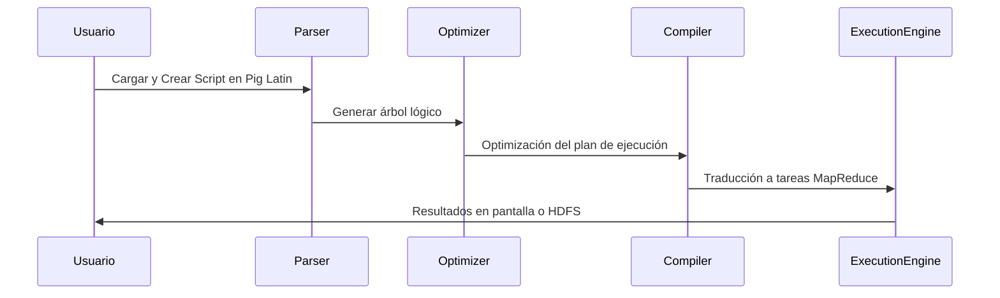
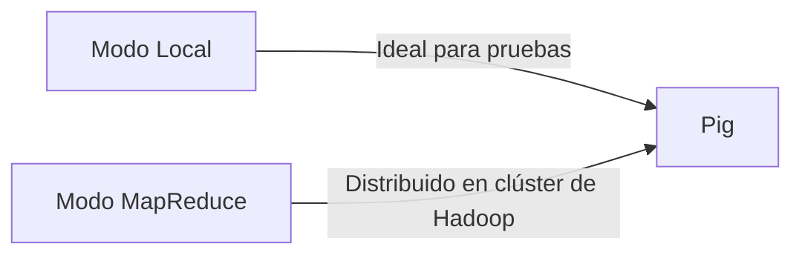

# Apache Pig: Procesamiento de Datos a Gran Escala en Hadoop 🐖


Apache Pig es una plataforma de análisis de datos de alto nivel en Hadoop, diseñada para procesar y transformar grandes volúmenes de datos de manera eficiente. Mediante el lenguaje **Pig Latin**, permite descripciones detalladas y expresivas de transformaciones complejas y flujos de datos. Además, soporta el análisis de datos no estructurados y semi-estructurados, optimizando automáticamente la ejecución de los scripts en Hadoop y permitiendo una mayor flexibilidad y potencia en el procesamiento de datos a gran escala sin necesidad de MapReduce en Java.

---

### 🚀 Ventajas Clave de Apache Pig para Profesionales de Big Data

1. **Optimización Automática de Consultas**: Pig optimiza los flujos de trabajo durante la fase de compilación del plan de ejecución, mejorando la eficiencia y reduciendo el tiempo de procesamiento.
2. **Interoperabilidad con HDFS y HCatalog**: Apache Pig facilita la lectura y escritura directa en Hadoop Distributed File System (HDFS) y en HCatalog, permitiendo una integración fluida con otros servicios y herramientas de datos.
3. **Extensibilidad y Funciones Definidas por el Usuario (UDFs)**: Los usuarios avanzados pueden personalizar Pig mediante UDFs en varios lenguajes, como Java, Python y JavaScript, adaptándolo a casos de procesamiento de datos específicos.

---

### Componentes de Pig 🧩


**Explicación de los Componentes**:

- **Parser**: Interpreta el script de Pig Latin y genera un árbol lógico que define las operaciones solicitadas por el usuario.
- **Optimizer**: A partir del árbol lógico, aplica optimizaciones como el reordenamiento de operaciones, el filtrado en proyección y la reducción de datos redundantes.
- **Compiler**: Convierte el plan lógico optimizado en un plan físico, donde cada operación se traduce en tareas de MapReduce u operaciones en modo local.
- **Execution Engine**: Ejecuta el plan físico, organizando las tareas y gestionando la comunicación entre nodos del clúster Hadoop, y genera el resultado final.

---

### 🛠 Flujo Complejo de Operaciones en Apache Pig


Apache Pig ejecuta sus tareas mediante un flujo estructurado de operaciones avanzadas:

1. **Carga de datos y creación del script en Pig Latin**: permite importar datos de distintas fuentes, facilitando el procesamiento y la transformación.
2. **Optimización y planificación**: Pig transforma el script en un plan de ejecución optimizado, utilizando técnicas avanzadas como **proyección anticipada** y **reordenamiento de operaciones** para maximizar la eficiencia.
3. **Ejecución del plan de ejecución**: Pig realiza las tareas en Hadoop, mostrando los resultados en pantalla o almacenándolos en HDFS.

---

### Modelo de Datos en Pig: Profundización en la Jerarquía 💾

Apache Pig maneja un modelo de datos jerárquico, ideal para gestionar datos no estructurados y semi-estructurados. Este modelo incluye las siguientes estructuras:

- **Atom**: Representa valores individuales (números, cadenas, etc.).
- **Tuple**: Un conjunto ordenado de valores, semejante a una fila en una tabla de datos.
- **Bag**: Colección no ordenada de tuplas, útil para agrupar datos y realizar análisis de agregación.
- **Map**: Estructura clave-valor que permite almacenar pares de valores asociados.

Ejemplo de datos complejos en Pig:

```javascript
// Modelo de datos avanzado en Pig
tupla_compleja = (42, "Big Data", [("clave1": "valor1"), ("clave2": "valor2")]);
mi_bag = {("apple", 1), ("banana", 2), ("cherry", 3)};
mi_map = ["id" # "1001", "nombre" # "John Doe", "edad" # 30];
```

---

### Modos de Ejecución Avanzados de Pig 🧑‍💻


Apache Pig puede ejecutarse en dos modos distintos, adaptándose a diferentes necesidades de procesamiento:

1. **Modo Local**: Ejecuta los scripts en la máquina local, ideal para pruebas y desarrollo.
2. **Modo MapReduce**: Ejecuta el flujo de trabajo como tareas distribuidas en un clúster de Hadoop, optimizando el procesamiento a gran escala.

### Interactividad en Pig: Modos de Ejecución Interactivos y en Lote

- **Modo Interactivo (Grunt Shell)**: Permite ejecutar comandos de Pig en tiempo real, facilitando el análisis exploratorio y la depuración de errores.
```Shell
grunt> registros = LOAD 'data.csv' AS (nombre:chararray, edad:int);
grunt> adultos = FILTER registros BY edad >= 18;
grunt> DUMP adultos;
```
- **Modo Batch**: Ejecuta scripts completos de Pig sin intervención, ideal para flujos de procesamiento automatizados y pipelines de datos.
```Shell
pig -x mapreduce mi_script.pig
```
---

### Comparación Profunda: Pig Latin vs SQL 🔍

| Aspecto                   | Pig Latin                         | SQL                            |
|---------------------------|-----------------------------------|--------------------------------|
| Paradigma                 | Flujo de datos                   | Declarativo                    |
| Estructura de datos       | Basado en Bag y Tuples           | Basado en Tablas               |
| Flexibilidad              | Alta, con soporte para datos jerárquicos   | Limitada a datos relacionales  |
| Tareas soportadas         | ETL, transformación compleja     | Consultas de bases de datos    |

---

### Guía de Comandos Principales en Apache Pig 🛠️

Apache Pig ofrece una serie de comandos básicos para cargar, transformar, filtrar y almacenar datos. A continuación, se presenta una guía rápida de los comandos esenciales de Pig Latin:

1. **Cargar Datos** (`LOAD`): Importa datos desde archivos externos en HDFS.
   ```javascript
   data = LOAD 'ruta/del/archivo.csv' USING PigStorage(',') AS (columna1:tipo, columna2:tipo);
   ```

2. **Almacenar Datos** (`STORE`): Guarda los datos procesados en HDFS.
   ```javascript
   STORE data INTO 'ruta/de/salida' USING PigStorage(',');
   ```

3. **Filtrar Datos** (`FILTER`): Filtra los datos en función de una condición.
   ```javascript
   filtered_data = FILTER data BY columna1 > 10;
   ```

4. **Agrupar Datos** (`GROUP`): Agrupa los datos en función de una o varias columnas.
   ```javascript
   grouped_data = GROUP data BY columna1;
   ```

5. **Aplicar Transformaciones** (`FOREACH ... GENERATE`): Genera un nuevo conjunto de datos transformando los datos existentes.
   ```javascript
   transformed_data = FOREACH data GENERATE columna1, columna2 * 2;
   ```

6. **Ordenar Datos** (`ORDER BY`): Ordena los datos en función de una columna en orden ascendente o descendente.
   ```javascript
   ordered_data = ORDER data BY columna1 DESC;
   ```

7. **Unir Tablas** (`JOIN`): Une dos o más conjuntos de datos en función de una clave común.
   ```javascript
   joined_data = JOIN data1 BY columna1, data2 BY columna1;
   ```

---

### Ejemplos Básicos de Scripts en Pig 🖥️

Estos ejemplos ilustran cómo aplicar los comandos de Pig Latin para realizar operaciones comunes en el procesamiento de datos:

1. **Cargar y Filtrar Datos**:
   ```javascript
   // Cargar el archivo y filtrar por edades mayores de 18
   usuarios = LOAD 'usuarios.csv' AS (nombre:chararray, edad:int);
   adultos = FILTER usuarios BY edad >= 18;
   ```

2. **Contar Palabras en Documentos**:
   ```javascript
   // Tokenizar las palabras y contar su frecuencia
   documentos = LOAD 'docs.txt' AS (linea:chararray);
   palabras = FOREACH documentos GENERATE FLATTEN(TOKENIZE(linea)) AS palabra;
   grupo_palabras = GROUP palabras BY palabra;
   frecuencia = FOREACH grupo_palabras GENERATE group AS palabra, COUNT(palabras) AS total;
   ```

3. **Calcular el Total de Ventas por Producto**:
   ```javascript
   // Cargar y calcular el total de ventas
   ventas = LOAD 'ventas.csv' AS (producto:chararray, cantidad:int, precio:float);
   total_ventas = FOREACH (GROUP ventas BY producto) GENERATE group AS producto, SUM(ventas.cantidad * ventas.precio) AS total;
   ```

4. **Ordenar los Datos de Ventas**:
   ```javascript
   // Ordenar las ventas por total en orden descendente
   ventas_ordenadas = ORDER total_ventas BY total DESC;
   ```

5. **Pipeline de ETL Simple**:
   ```javascript
   // ETL: Cargar, filtrar, transformar y almacenar resultados
   raw_data = LOAD 'raw_data.csv' AS (id:int, valor:float);
   filtered_data = FILTER raw_data BY valor > 50;
   transformed_data = FOREACH filtered_data GENERATE id, valor * 0.8 AS valor_transformado;
   STORE transformed_data INTO 'datos_procesados' USING PigStorage(',');
   ```

### Conclusión

Apache Pig es una herramienta poderosa y flexible para el procesamiento avanzado de datos en Big Data, ofreciendo un entorno optimizado y adaptable para transformar grandes volúmenes de información. Con su capacidad para optimizar consultas, integrar UDFs y manejar modelos de datos jerárquicos, Pig se convierte en un componente esencial para los profesionales de datos que trabajan en Hadoop, permitiendo la transformación de datos de manera eficiente sin la complejidad de MapReduce manual.