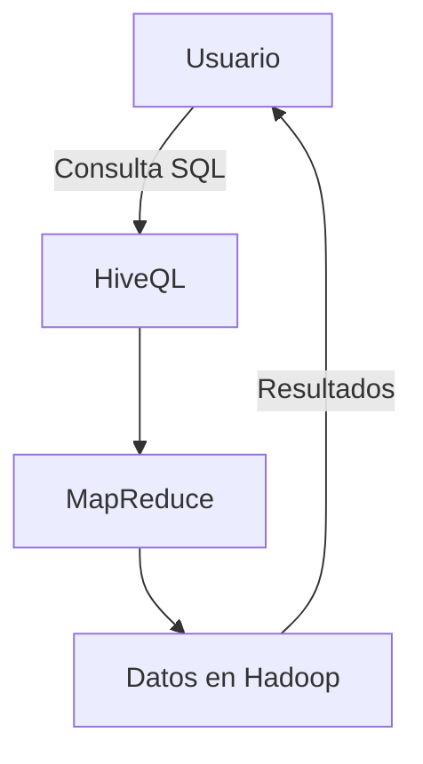

# Introducción a Apache Hive en JavaScript 🚀

{: height="150px" width="150px"}

### ¿Qué es Apache Hive? 🐝

Apache Hive es una plataforma de **procesamiento y almacenamiento de datos en grandes volúmenes** desarrollada inicialmente por Facebook, ahora parte del ecosistema Apache. Su principal propósito es simplificar el acceso y análisis de grandes datos almacenados en **Apache Hadoop**, permitiendo a los usuarios usar una sintaxis similar a SQL a través de su propio lenguaje: **HiveQL**. 

Hive transforma el **almacenamiento distribuido en Hadoop** en una base de datos relacional accesible para quienes prefieren un enfoque SQL. Esto permite consultas complejas y análisis sin tener que lidiar con los detalles técnicos de Hadoop o MapReduce.

### Características Principales de Hive 🔍

- **Acceso SQL**: Permite ejecutar consultas SQL (HiveQL) en datos almacenados en Hadoop.
- **Escalabilidad**: Maneja conjuntos de datos extremadamente grandes con facilidad.
- **Integración con Hadoop**: Hive corre sobre Hadoop, lo que facilita la utilización de su infraestructura para tareas de procesamiento masivo.
- **Esquema de Lectura**: Los datos se estructuran durante la consulta, lo cual es ideal para datos semi-estructurados y no estructurados.

### Limitaciones de Apache Hive ⚠️

A pesar de sus ventajas, Hive tiene algunas limitaciones:

1. **No es ideal para consultas en tiempo real**: Las consultas pueden tardar debido al procesamiento en Hadoop.
2. **No soporta transacciones completas**: Está orientado a **lecturas** y **análisis**, no tanto a **escrituras transaccionales**.
3. **Latencia en el rendimiento**: Al depender de MapReduce, algunas operaciones pueden ser lentas comparado con bases de datos en tiempo real.
   
### ¿Para qué se usa Apache Hive? 📊

Hive se utiliza principalmente para:

- **Análisis de grandes volúmenes de datos** en ambientes empresariales.
- **Informes y visualización** de datos históricos.
- **Procesamiento por lotes** para transformar y limpiar datos.

Su diseño es ideal para **Data Warehousing** y proyectos de **Big Data** donde se requiere manipular y analizar grandes volúmenes de datos.

### HiveQL: El Lenguaje de Consultas de Hive 📝

**HiveQL** es el lenguaje de consultas de Apache Hive, similar a SQL, diseñado para facilitar la extracción de datos en Hadoop. **HiveQL** permite a los usuarios **crear tablas**, **consultar datos**, **hacer agregaciones** y **uniones**, entre otras acciones.

#### Acciones Posibles 🛠️

- **SELECT**: Extrae datos.
- **INSERT**: Inserta datos en tablas.
- **CREATE TABLE**: Define la estructura de los datos.
- **JOIN**: Permite combinar datos de varias tablas.

```sql
-- Ejemplo de sintaxis básica en HiveQL
CREATE TABLE estudiantes (
  id INT,
  nombre STRING,
  edad INT
);

-- Consultar datos
SELECT nombre, edad FROM estudiantes WHERE edad > 18;
```

#### Ejemplo en JavaScript de una Simulación de Consulta en HiveQL 💻

Para ilustrar la interacción con Hive, aquí tienes una representación en JavaScript de cómo estructurar y ejecutar una consulta en HiveQL. En este caso, simularemos una simple selección y filtrado.

```javascript
// Definimos un dataset simulado
const estudiantes = [
  { id: 1, nombre: "Ana", edad: 22 },
  { id: 2, nombre: "Luis", edad: 17 },
  { id: 3, nombre: "Marta", edad: 19 },
];

// Simulación de una consulta en HiveQL
const consulta = estudiantes.filter(estudiante => estudiante.edad > 18);
console.log("Estudiantes mayores de 18 años:", consulta);
```

### Resumen Visual de Hive en Diagrama



> **Apache Hive** transforma las consultas de alto nivel en código MapReduce, y estos procesos son ejecutados en **Hadoop**, lo que hace que el procesamiento sea eficiente y escalable.

### ¿Listo para explorar el poder de Hive? 🐝

Apache Hive convierte las bases de datos masivas en fuentes accesibles para análisis y datos. A través de **HiveQL**, los usuarios pueden aprovechar al máximo el potencial de **Big Data** sin necesidad de ser expertos en programación distribuida.