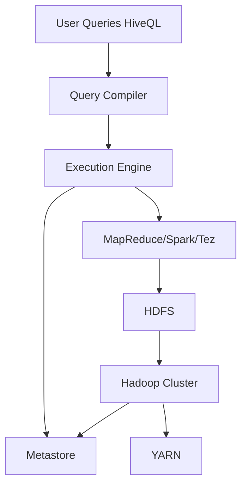

# Introducción a Apache Hive 🚀

{: height="150px" width="150px"}

## ¿Qué es Apache Hive? 🐝

### Historia y Propósito 📖  
Apache Hive fue desarrollado inicialmente por **Facebook** en 2007 para simplificar el procesamiento de datos masivos en **Hadoop**. Su objetivo principal es permitir consultas de estilo SQL sobre datos almacenados en sistemas distribuidos, eliminando la complejidad de trabajar directamente con **MapReduce**. En 2010, pasó a ser parte de la **Apache Software Foundation**, consolidándose como una herramienta esencial en el ecosistema de **Big Data**.

### Comparación con Bases de Datos Tradicionales ⚖️  
Aunque Hive utiliza un lenguaje similar a SQL llamado **HiveQL**, no es una base de datos tradicional. En lugar de manejar transacciones en tiempo real o trabajar con estructuras completamente normalizadas, Hive está diseñado para el análisis y procesamiento de **grandes volúmenes de datos** en sistemas distribuidos.  

| Característica          | Apache Hive                      | Bases de Datos Tradicionales |
| ----------------------- | -------------------------------- | ---------------------------- |
| **Uso principal**       | Análisis de datos a gran escala  | Transacciones en tiempo real |
| **Escalabilidad**       | Altamente escalable en clústeres | Limitada a un solo servidor  |
| **Procesamiento**       | Lote (Batch Processing)          | Tiempo real (OLTP)           |
| **Estructura de datos** | Datos semi/no estructurados      | Datos estructurados          |

### Casos de Uso 🔍  
1. **Análisis de logs de servidores web**: Empresas como Facebook o Amazon lo utilizan para analizar millones de registros diarios.  
      - Ejemplo de registros:  
        ```
        192.168.1.1 - - [27/Nov/2024:10:30:00 +0000] "GET /home HTTP/1.1" 200 2048  
        192.168.1.2 - - [27/Nov/2024:10:30:05 +0000] "POST /login HTTP/1.1" 302 512  
        ```
        Información extraída: Direcciones IP, rutas solicitadas, códigos de estado, y tamaños de respuesta.  

2. **Agrupación de datos para informes**: Ideal para reportes históricos en proyectos de **Data Warehousing**.  
      - **¿Qué es Data Warehousing?**  
        Es un sistema de almacenamiento diseñado para consolidar y analizar datos históricos provenientes de diferentes fuentes, optimizando la toma de decisiones empresariales.

3. **Transformación de datos en pipelines**: Se emplea en procesos por lotes para limpiar y transformar datos en entornos distribuidos.  
      - **¿Qué es un pipeline de datos?**  
        Es una serie de pasos o procesos automatizados que convierten datos crudos en información lista para análisis.  

        **Diagrama del Pipeline:**  
        ```mermaid
        graph TD;
            A[Datos Brutos] --> B[Limpieza];
            B --> C[Transformación];
            C --> D[Almacenamiento Analítico];
            D --> E[Análisis/Visualización];
        ```

4. **Integración con herramientas de visualización**: Hive puede servir como backend para herramientas como Tableau o Power BI.

---

## Arquitectura de Hive 🏗️

Hive se compone de varios componentes que trabajan juntos para procesar y analizar datos masivos de manera eficiente.

### 1. Metastore 📂  
El **Metastore** es el núcleo de la arquitectura de Hive. Este almacén de metadatos contiene información sobre:  

- **Esquema de tablas**: Columnas, tipos de datos, particiones.  
- **Ubicación de datos**: Rutas dentro de Hadoop Distributed File System (**HDFS**) o fuentes externas como **Amazon S3**.  
- **Información de permisos**: Control de acceso a tablas y datos.  

> **Ejemplo:** Si una tabla de Hive utiliza particiones por fecha, el Metastore almacena los detalles de estas particiones para facilitar las consultas.

### 2. Query Compiler 🧮  
El **Query Compiler** toma las consultas en **HiveQL** y las traduce en **planes de ejecución** compatibles con Hadoop.

- Divide las consultas en etapas lógicas.  
- Genera tareas de MapReduce o Spark para ejecutarlas.  
- Optimiza el procesamiento para mejorar el rendimiento.  

> **Dato Interesante:** Gracias al Query Compiler, usuarios sin experiencia en MapReduce pueden ejecutar análisis complejos con facilidad.

### 3. Execution Engine ⚙️  
El **Execution Engine** ejecuta las tareas generadas por el Query Compiler en el clúster de Hadoop.  

- Coordina las tareas de procesamiento.  
- Administra los recursos del clúster para garantizar que las consultas se ejecuten de manera eficiente.  

El motor utiliza herramientas como **Tez**, **MapReduce**, o incluso **Spark**, dependiendo de la configuración.

### 4. Integración con Hadoop y HDFS 🌐  
Hive está profundamente integrado con el **Hadoop Distributed File System (HDFS)**.  

- Los datos se almacenan en HDFS, lo que asegura escalabilidad y alta disponibilidad.  
- Las tareas se ejecutan utilizando la infraestructura de Hadoop, como MapReduce o Tez.  

Además, Hive se conecta con otras herramientas del ecosistema, como **YARN** para la gestión de recursos y **HBase** para almacenamiento de datos NoSQL.

---

### Diagrama de la Arquitectura de Hive 🖼️  

El siguiente diagrama muestra cómo los diferentes componentes interactúan en Apache Hive:  



Hive combina la facilidad de consultas estilo SQL con la potencia del procesamiento distribuido. Es una herramienta clave para empresas que manejan grandes volúmenes de datos y buscan maximizar el potencial de sus clústeres de Hadoop. 🚀