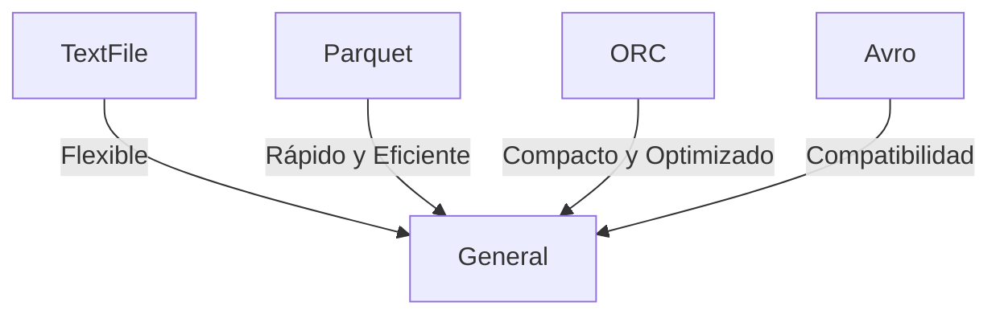
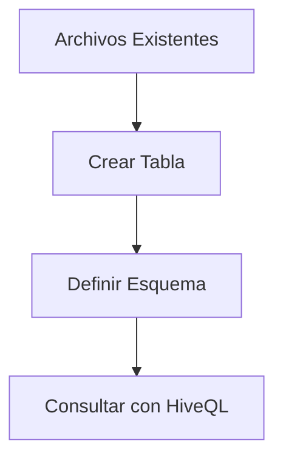

# **Gestión de Datos en Apache Hive: Una Guía Atractiva para Desarrolladores**
## **1. Creación de Bases de Datos y Tablas** 🏗️

### **Tipos de Tablas: Internas vs Externas**  
En Apache Hive, puedes trabajar con dos tipos principales de tablas:  

1. **Tablas Internas (Gestionadas)** 🛠️  
      - Hive controla tanto el esquema como los datos.  
      - Los datos se almacenan en la ubicación predeterminada del warehouse de Hive (`/user/hive/warehouse/`).  
      - **Advertencia:** Si eliminas la tabla, ¡los datos también se eliminan!  

      ```sql
      CREATE TABLE empleados (
        id INT,
        nombre STRING,
        salario FLOAT
      );
      ```

      **Úsalo cuando Hive deba gestionar completamente los datos.**

2. **Tablas Externas** 🌐  
      - Hive solo administra el esquema, pero los datos permanecen en una ubicación externa como S3 o HDFS.  
      - Al eliminar la tabla, los datos **no se borran**.  

      ```sql
      CREATE EXTERNAL TABLE ventas (
        id INT,
        producto STRING,
        cantidad INT
      )
      STORED AS TEXTFILE
      LOCATION '/data/ventas/';
      ```

      **Perfecto para datos que ya existen y no deseas duplicar.**

---

### **Sintaxis Básica para Crear Tablas**  
Crear tablas en Hive es similar a SQL, pero con soporte para particiones y formatos avanzados.

```sql
CREATE TABLE productos (
  id INT,
  nombre STRING,
  precio FLOAT
)
PARTITIONED BY (categoria STRING)
STORED AS PARQUET;
```

- **`PARTITIONED BY`**: Divide los datos por columnas específicas, como `categoria`.
- **`STORED AS PARQUET`**: Especifica el formato de almacenamiento.

---

### **Configuración de Ubicaciones en S3 o HDFS** 🌍  

Hive puede trabajar con datos en diferentes ubicaciones.  

#### **Ejemplo: Almacenar en S3**  
```sql
CREATE EXTERNAL TABLE logs (
  fecha STRING,
  nivel STRING,
  mensaje STRING
)
STORED AS TEXTFILE
LOCATION 's3://mi-bucket/logs/';
```

#### **Ejemplo: Almacenar en HDFS**  
```sql
CREATE EXTERNAL TABLE transacciones (
  id INT,
  monto FLOAT
)
STORED AS ORC
LOCATION '/data/warehouse/transacciones/';
```

---

## **2. Formatos de Datos Soportados** 📦

Apache Hive soporta varios formatos para optimizar el almacenamiento y la consulta. Aquí están los más comunes:

| **Formato**  | **Ventajas**                                                      | **Desventajas**                            | **Ideal Para**           |
| ------------ | ----------------------------------------------------------------- | ------------------------------------------ | ------------------------ |
| **TextFile** | Simple, ampliamente compatible.                                   | Ineficiente en espacio y procesamiento.    | Datos crudos o pequeños. |
| **Parquet**  | Almacenamiento columnar, compresión eficiente, rápido en lectura. | Costoso en actualizaciones.                | Consultas analíticas.    |
| **ORC**      | Optimizado para Hive, excelente compresión.                       | Limitado fuera del ecosistema Hadoop.      | Data Warehousing.        |
| **Avro**     | Compatible con esquemas, ideal para intercambio entre sistemas.   | Menos eficiente para consultas analíticas. | Interoperabilidad.       |

---

### **Cómo Elegir el Formato Adecuado**  
- **Datos pequeños y simples**: Usa **TextFile**.  
- **Consultas analíticas rápidas**: Prefiere **Parquet** o **ORC**.  
- **Intercambio entre sistemas**: Opta por **Avro**.  

#### **Comparación Visual de Formatos**  


---

## **3. Cargar Datos en Tablas** 📥  

### **Comando `LOAD DATA`**  
El comando `LOAD DATA` permite cargar datos desde HDFS o el sistema local directamente en una tabla de Hive.

#### **Desde HDFS**  
```sql
LOAD DATA INPATH '/hdfs/datos/ventas.csv' INTO TABLE ventas;
```

#### **Desde el Sistema Local**  
```sql
LOAD DATA LOCAL INPATH '/local/datos/ventas.csv' INTO TABLE ventas;
```

---

### **Importar Datos desde S3**  
Hive también puede cargar datos almacenados en S3. Asegúrate de configurar las credenciales de AWS correctamente.  

```sql
LOAD DATA INPATH 's3://mi-bucket/ventas.csv' INTO TABLE ventas;
```

---

### **Creación de Tablas a Partir de Archivos Existentes**  
Hive puede crear automáticamente una tabla basada en la estructura de un archivo existente.

```sql
CREATE EXTERNAL TABLE logs (
  fecha STRING,
  nivel STRING,
  mensaje STRING
)
STORED AS TEXTFILE
LOCATION '/hdfs/logs/';
```

#### **Diagrama del Proceso**  


---

¡Con estas herramientas, puedes gestionar datos en Apache Hive de manera eficiente y optimizada, ya sea que trabajes con datos locales, en HDFS o S3! 🚀