# **Consultas y Optimización en Apache Hive con HiveQL** 🚀

## **1. Consulta Básica con HiveQL** 🛠️

### **Sentencias `SELECT` y `WHERE`**  
El comando `SELECT` es la base de cualquier consulta en HiveQL. Puedes seleccionar columnas específicas y usar `WHERE` para filtrar datos.

#### **Ejemplo en JavaScript (Simulación):**
```javascript
const empleados = [
  { id: 1, nombre: "Ana", salario: 3000 },
  { id: 2, nombre: "Luis", salario: 4000 },
  { id: 3, nombre: "Marta", salario: 2500 },
];

// Filtrar empleados con salario mayor a 3000
const filtrados = empleados.filter(emp => emp.salario > 3000);
console.log(filtrados);
```

#### **Consulta Equivalente en HiveQL:**
```sql
SELECT nombre, salario 
FROM empleados
WHERE salario > 3000;
```

---

### **Ordenamiento y Agrupamiento**  
HiveQL soporta `ORDER BY`, `GROUP BY` y `HAVING` para organizar y analizar datos:

1. **`ORDER BY`**: Ordena los resultados.
2. **`GROUP BY`**: Agrupa datos.
3. **`HAVING`**: Filtra grupos después del agrupamiento.

#### **Ejemplo Visual:**
```sql
SELECT departamento, AVG(salario) AS salario_promedio
FROM empleados
GROUP BY departamento
HAVING AVG(salario) > 3500
ORDER BY salario_promedio DESC;
```

| **Departamento** | **Salario Promedio** |
| ---------------- | -------------------- |
| IT               | 4500                 |
| Marketing        | 3600                 |

---

### **Funciones Básicas: `COUNT`, `AVG`, `SUM`**  
HiveQL incluye funciones para análisis básico de datos:

```sql
SELECT COUNT(*) AS total_empleados, SUM(salario) AS salario_total, AVG(salario) AS salario_promedio
FROM empleados;
```

---

## **2. Consultas Avanzadas** 🎯

### **Subconsultas**  
Usa subconsultas para realizar consultas dentro de otras consultas:

```sql
SELECT nombre, salario
FROM empleados
WHERE salario > (
    SELECT AVG(salario) 
    FROM empleados
);
```

---

### **Uniones: `JOIN`, `LEFT JOIN`, `RIGHT JOIN`, `FULL OUTER JOIN`**  
Une tablas para combinarlas en un solo conjunto de datos.

#### **Ejemplo:**
```sql
SELECT e.nombre, e.salario, d.nombre AS departamento
FROM empleados e
JOIN departamentos d ON e.depto_id = d.id;
```

| **Nombre** | **Salario** | **Departamento** |
| ---------- | ----------- | ---------------- |
| Ana        | 3000        | IT               |
| Luis       | 4000        | Marketing        |

---

### **Funciones Analíticas**  
Las funciones analíticas como `ROW_NUMBER`, `RANK` y `WINDOW` permiten realizar análisis avanzados.

#### **Ejemplo:**
```sql
SELECT nombre, salario, RANK() OVER (ORDER BY salario DESC) AS ranking
FROM empleados;
```

---

## **3. Particionamiento y Bucketing** 📂

### **Conceptos Básicos**  
- **Particionamiento**: Divide una tabla en subdirectorios según el valor de una columna.  
- **Bucketing**: Divide particiones en pequeños archivos basados en un valor hash.

---

### **Creación de Tablas Particionadas**  
```sql
CREATE TABLE ventas (
  id INT,
  producto STRING,
  cantidad INT
) PARTITIONED BY (fecha STRING);
```

- Los datos se dividen por fecha:  
  ```
  /user/hive/warehouse/ventas/fecha=2024-11-01/
  ```

---

### **Implementación de Buckets**  
Los buckets son útiles para mejorar el rendimiento de consultas:

```sql
CREATE TABLE usuarios (
  id INT,
  nombre STRING
)
CLUSTERED BY (id) INTO 4 BUCKETS;
```

---

## **4. Optimización de Consultas** ⚡

### **Uso de Índices**  
Aunque no es común, Hive soporta índices simples para acelerar consultas:

```sql
CREATE INDEX idx_ventas_fecha ON TABLE ventas (fecha)
AS 'COMPACT' WITH DEFERRED REBUILD;
```

---

### **Configuración de Motores de Ejecución: Tez y Spark**  
Para mejorar el rendimiento, puedes usar motores avanzados como **Tez** o **Spark** en lugar de MapReduce.

```bash
SET hive.execution.engine=tez;
-- O
SET hive.execution.engine=spark;
```

---

### **Optimización con Tablas ORC y Parquet**  
- **ORC** y **Parquet** son formatos columnar optimizados para Big Data.
- Ofrecen:
    - Compresión eficiente.
    - Lectura rápida para consultas analíticas.

```sql
CREATE TABLE optimizada (
  id INT,
  datos STRING
)
STORED AS ORC;
```

#### **Comparación Visual de Rendimiento:**

```mermaid
graph LR;
    A[TextFile] -->|Lento| B[ORC];
    C[Parquet] -->|Rápido| B;
    B -->|Optimizado| D[Consulta Eficiente];
```


---

Con estas herramientas y técnicas, ¡puedes realizar análisis avanzados y optimizar tus consultas en Apache Hive como un profesional! 🚀